<p align="center">
  
</p>

<p align="center">
  
  
  
</p>

<p align="center">
  <b>AI 기반 코딩 보조 도구 Claude Code를 처음부터 마스터하는 완벽 가이드</b>
</p>

---

## 목차

| 번호 | 주제 | 설명 |
|:---:|------|------|
| 1 | [개요 & 설치](#1-개요--설치) | Claude Code란? 설치 방법 |
| 2 | [기본 인터페이스](#2-기본-인터페이스) | 화면 구성, 프롬프트 입력 |
| 3 | [슬래시 명령어 전체 목록](#3-슬래시-명령어-전체-목록) | 모든 / 명령어 정리 |
| 4 | [키보드 단축키 전체 목록](#4-키보드-단축키-전체-목록) | 모든 단축키 정리 |
| 5 | [권한 시스템](#5-권한-시스템) | 보안 및 권한 관리 |
| 6 | [프롬프트 입력 방법](#6-프롬프트-입력-방법) | 효과적인 프롬프트 작성법 |
| 7 | [MCP 서버](#7-mcp-서버) | 외부 도구 연결 |
| 8 | [Hooks](#8-hooks) | 자동화 설정 |
| 9 | [설정 파일](#9-설정-파일) | CLAUDE.md, settings.json |
| 10 | [IDE 통합](#10-ide-통합) | VS Code, JetBrains |
| 11 | [실전 워크플로우](#11-실전-워크플로우) | 실제 사용 예시 |
| 12 | [초급자 팁](#12-초급자-팁) | 모범 사례 및 흔한 실수 |

---

## 1. 개요 & 설치

### Claude Code란?

> **Claude Code**는 Anthropic이 만든 AI 기반 코딩 보조 도구로, 터미널에서 직접 코드를 읽고, 편집하고, 실행할 수 있습니다.

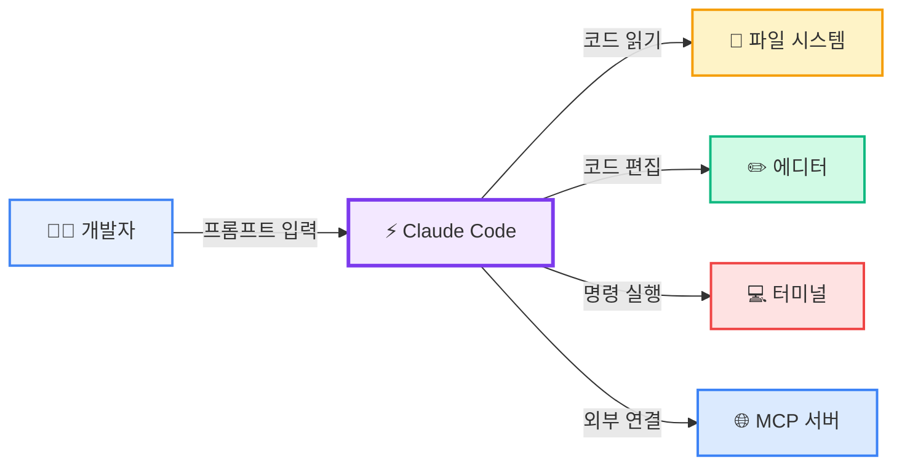

### Claude Code가 할 수 있는 것

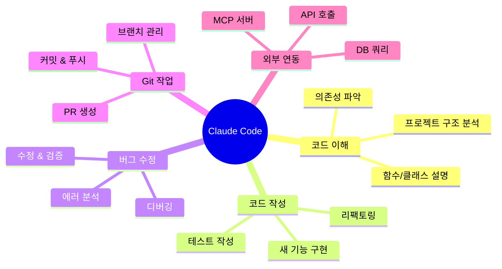

### 시스템 요구사항

| 항목 | 요구사항 |
|------|---------|
| **OS** | macOS, Linux, WSL, Windows (Git for Windows 필요) |
| **구독** | Claude Pro, Max, Teams, Enterprise 또는 Anthropic Console |
| **Node.js** | 18+ (npm 설치 시) |

### 설치 방법

#### 방법 1: Native Install (권장 - 자동 업데이트)

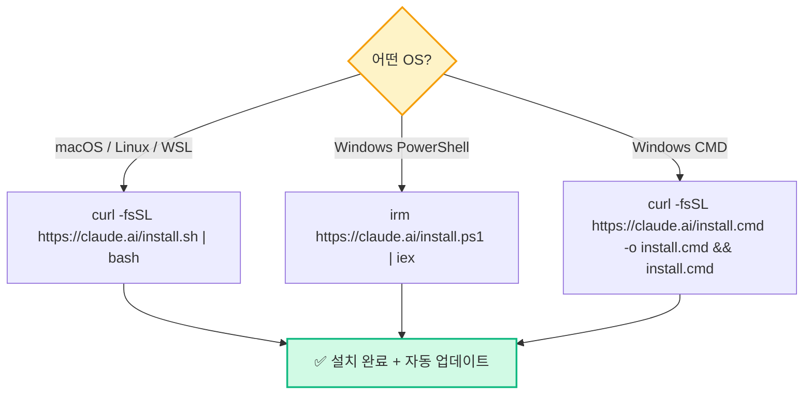

**macOS / Linux / WSL:**
```bash
curl -fsSL https://claude.ai/install.sh | bash
```

**Windows PowerShell:**
```powershell
irm https://claude.ai/install.ps1 | iex
```

**Windows CMD:**
```batch
curl -fsSL https://claude.ai/install.cmd -o install.cmd && install.cmd && del install.cmd
```

#### 방법 2: 패키지 매니저

```bash
# Homebrew (macOS)
brew install --cask claude-code

# WinGet (Windows)
winget install Anthropic.ClaudeCode
```

> **참고**: 패키지 매니저로 설치하면 수동 업데이트가 필요합니다.

### 첫 번째 실행

```bash
# 1. 프로젝트 디렉토리로 이동
cd /your/project

# 2. Claude Code 실행
claude

# 3. 첫 실행 시 로그인 프롬프트가 나타남
```

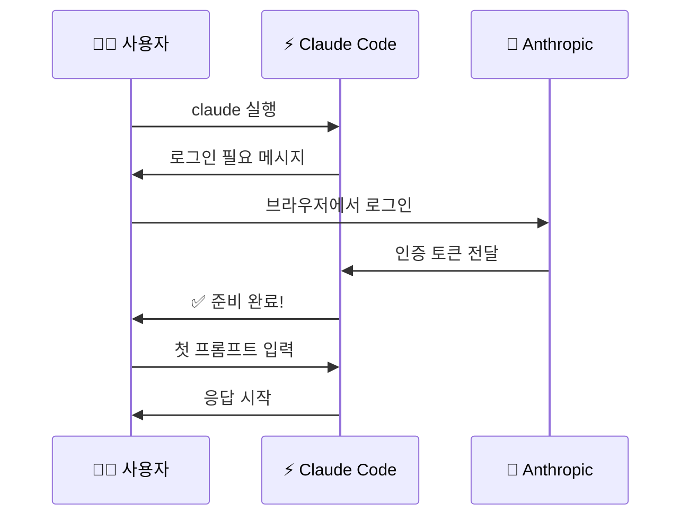

---

## 2. 기본 인터페이스

### 화면 구성

Claude Code 터미널 인터페이스는 다음과 같이 구성됩니다:

```
┌──────────────────────────────────────────────────────┐
│  Claude Code v1.x.x                    claude-opus-4-6│ ← 상태 표시줄
├──────────────────────────────────────────────────────┤
│                                                      │
│  > 이 프로젝트가 뭐 하는 거야?                         │ ← 사용자 입력
│                                                      │
│  이 프로젝트는 Node.js 기반의 웹 애플리케이션으로...     │ ← Claude 응답
│                                                      │
│  📁 src/index.ts                                      │
│  ┌──────────────────────────────────────────────┐    │ ← 파일 내용
│  │ 1  import express from 'express';            │    │
│  │ 2  const app = express();                     │    │
│  │ 3  ...                                        │    │
│  └──────────────────────────────────────────────┘    │
│                                                      │
│  ✅ Task completed                                    │ ← 작업 상태
│                                                      │
├──────────────────────────────────────────────────────┤
│  > _                                                  │ ← 프롬프트 입력
│                                                      │
│  [Auto-Accept] [claude-opus-4-6] [Context: ████░░ 45%]│ ← 하단 상태바
└──────────────────────────────────────────────────────┘
```

### 인터페이스 요소 설명

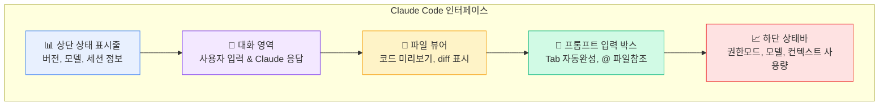

### 프롬프트 입력 박스 기능

| 기능 | 방법 | 설명 |
|------|------|------|
| 자동 완성 | `Tab` | 명령어, 파일 경로 자동 완성 |
| 파일 참조 | `@파일명` | 특정 파일을 컨텍스트에 추가 |
| 히스토리 | `↑` / `↓` | 이전 입력 탐색 |
| 명령어 모드 | `/` | 슬래시 명령어 입력 |
| Bash 모드 | `!` | 셸 명령어 직접 실행 |
| 멀티라인 | `Shift+Enter` | 여러 줄 입력 |

---

## 3. 슬래시 명령어 전체 목록

### 명령어 카테고리 맵

```mermaid
graph TD
    CENTER["/ 슬래시 명령어"]

    CENTER --> A["🔄 세션 관리"]
    CENTER --> B["⚙️ 설정"]
    CENTER --> C["🤖 모델 & 성능"]
    CENTER --> D["🔒 권한 & 보안"]
    CENTER --> E["📝 코드 리뷰"]
    CENTER --> F["🌐 MCP & 연결"]
    CENTER --> G["🧠 메모리 & 스킬"]
    CENTER --> H["💰 비용 & 사용량"]
    CENTER --> I["🖥️ IDE & 도구"]
    CENTER --> J["🔧 고급 기능"]

    A --> A1["/clear /resume /fork<br/>/rename /rewind"]
    B --> B1["/config /status<br/>/doctor /login /logout"]
    C --> C1["/model /fast<br/>/compact"]
    D --> D1["/permissions /plan<br/>/sandbox"]
    E --> E1["/review /pr-comments<br/>/security-review /simplify"]
    F --> F1["/mcp /chrome"]
    G --> G1["/memory /init<br/>/skills /plugin"]
    H --> H1["/cost /usage<br/>/context"]
    I --> I1["/ide /desktop<br/>/terminal-setup /vim"]
    J --> J1["/hooks /agents<br/>/tasks /diff /export"]

    style CENTER fill:#7C3AED,stroke:#5B21B6,color:white,stroke-width:3px
    style A fill:#DBEAFE,stroke:#3B82F6
    style B fill:#FEF3C7,stroke:#F59E0B
    style C fill:#D1FAE5,stroke:#10B981
    style D fill:#FEE2E2,stroke:#EF4444
    style E fill:#E8F0FE,stroke:#4285F4
    style F fill:#F3E8FF,stroke:#7C3AED
    style G fill:#FECACA,stroke:#DC2626
    style H fill:#FDE68A,stroke:#D97706
    style I fill:#C7D2FE,stroke:#6366F1
    style J fill:#D1D5DB,stroke:#6B7280
```

### 핵심 명령어 (매일 사용)

| 명령어 | 목적 | 사용 예시 |
|--------|------|----------|
| `/help` | 사용 가능한 명령어 표시 | `/help` |
| `/clear` | 대화 이력 삭제, 새 세션 시작 | `/clear` |
| `/exit` 또는 `/quit` | Claude Code 종료 | `/exit` |

### 세션 관리

| 명령어 | 목적 | 사용 예시 |
|--------|------|----------|
| `/resume [session]` | 이전 대화 재개 | `/resume my-session` |
| `/continue` | `/resume`과 동일 | `/continue` |
| `/rename [name]` | 현재 세션 이름 변경 | `/rename auth-feature` |
| `/fork [name]` | 현재 지점에서 대화 분기 | `/fork experiment-1` |
| `/rewind` | 이전 상태로 되돌리기 | `/rewind` |

```mermaid
gitgraph
    commit id: "세션 시작"
    commit id: "대화 진행"
    commit id: "대화 더 진행"
    branch "fork: experiment-1"
    checkout "fork: experiment-1"
    commit id: "실험적 변경"
    commit id: "다른 접근"
    checkout main
    commit id: "원래 방향 계속"
    commit id: "/rewind로 되돌리기 가능"
```

### 설정 및 구성

| 명령어 | 목적 |
|--------|------|
| `/config` 또는 `/settings` | 설정 인터페이스 열기 |
| `/status` | 버전, 모델, 계정, 연결성 표시 |
| `/doctor` | 설치 및 설정 진단 |
| `/login` | 계정에 로그인 |
| `/logout` | 계정에서 로그아웃 |

### 모델 및 성능

| 명령어 | 목적 | 사용 예시 |
|--------|------|----------|
| `/model [model]` | AI 모델 선택/변경 | `/model claude-sonnet-4-6` |
| `/fast [on\|off]` | Fast Mode 토글 | `/fast on` |
| `/compact [instructions]` | 대화 요약 | `/compact 중요한 결정사항 유지` |

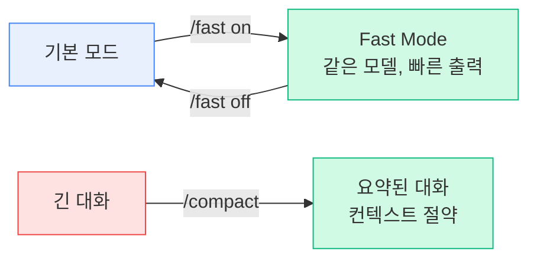

### 권한 및 보안

| 명령어 | 목적 |
|--------|------|
| `/permissions` | 권한 설정 보기/수정 |
| `/plan` | Plan Mode로 진입 (읽기 전용) |
| `/sandbox` | Sandbox 모드 토글 |

### 코드 리뷰 및 분석

| 명령어 | 목적 | 사용 예시 |
|--------|------|----------|
| `/review [PR]` | Pull Request 코드 리뷰 | `/review 42` |
| `/pr-comments [PR]` | GitHub PR 댓글 가져오기 | `/pr-comments 42` |
| `/security-review` | 보안 취약점 분석 | `/security-review` |
| `/simplify` | 변경된 코드 검토 및 최적화 | `/simplify` |

### MCP 및 연결

| 명령어 | 목적 |
|--------|------|
| `/mcp` | MCP 서버 연결 및 인증 관리 |
| `/chrome` | Chrome 브라우저 자동화 설정 |

### 메모리 및 스킬

| 명령어 | 목적 | 사용 예시 |
|--------|------|----------|
| `/memory` | CLAUDE.md 메모리 파일 편집 | `/memory` |
| `/init` | 프로젝트용 CLAUDE.md 초기화 | `/init` |
| `/skills` | 사용 가능한 스킬 목록 | `/skills` |
| `/plugin` | 플러그인 관리 | `/plugin` |

### 비용 및 사용량

| 명령어 | 목적 |
|--------|------|
| `/cost` | 토큰 사용량 통계 표시 |
| `/usage` | Plan 사용 제한 및 속도 제한 상태 |
| `/context` | 현재 컨텍스트 사용량을 색상 그리드로 표시 |

### IDE 및 도구

| 명령어 | 목적 |
|--------|------|
| `/ide` | IDE 통합 관리 및 상태 표시 |
| `/desktop` 또는 `/app` | Claude Code Desktop 앱으로 계속 |
| `/terminal-setup` | 터미널 키 바인딩 설정 |
| `/vim` | Vim/Normal 편집 모드 토글 |

### 고급 기능

| 명령어 | 목적 |
|--------|------|
| `/hooks` | Hook 구성 관리 |
| `/agents` | Subagent 관리 |
| `/tasks` | 백그라운드 작업 관리 |
| `/diff` | 대화형 diff 뷰어 열기 |
| `/export [filename]` | 대화를 텍스트로 내보내기 |
| `/copy` | 마지막 응답을 클립보드로 복사 |
| `/theme` | 색상 테마 변경 |
| `/add-dir <path>` | 작업 디렉토리 추가 |

### 정보 및 피드백

| 명령어 | 목적 |
|--------|------|
| `/feedback` 또는 `/bug` | 피드백 제출 |
| `/release-notes` | 변경 로그 보기 |

---

## 4. 키보드 단축키 전체 목록

### 단축키 카테고리 맵

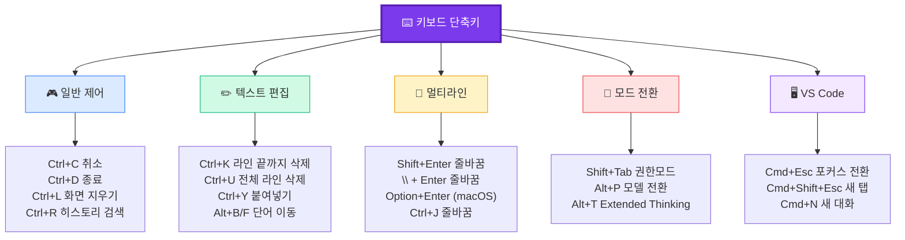

### 일반 제어

| 단축키 | 설명 |
|---------|------|
| `Ctrl+C` | 현재 입력 또는 생성 취소 |
| `Ctrl+D` | Claude Code 종료 |
| `Ctrl+F` | 백그라운드 에이전트 종료 (3초 내 2번) |
| `Ctrl+L` | 터미널 화면 지우기 (대화는 유지) |
| `Ctrl+O` | Verbose 모드 토글 (상세 정보 표시) |
| `Ctrl+R` | 명령 히스토리 역순 검색 |
| `Ctrl+T` | 작업 목록 표시/숨기기 |
| `Ctrl+B` | 작업을 백그라운드로 전환 |
| `Ctrl+G` | 기본 텍스트 편집기로 열기 |

### 텍스트 편집

| 단축키 | 설명 |
|---------|------|
| `Ctrl+K` | 커서부터 라인 끝까지 삭제 |
| `Ctrl+U` | 전체 라인 삭제 |
| `Ctrl+Y` | 삭제된 텍스트 붙여넣기 |
| `Alt+B` | 커서를 한 단어 뒤로 이동 |
| `Alt+F` | 커서를 한 단어 앞으로 이동 |
| `Alt+Y` | 붙여넣기 히스토리 순환 (Ctrl+Y 이후) |
| `↑` / `↓` | 명령 히스토리 탐색 |
| `←` / `→` | 다이얼로그 탭 이동 |

### 이미지 & 파일 붙여넣기

| 단축키 | 설명 |
|---------|------|
| `Ctrl+V` | 클립보드에서 이미지 붙여넣기 (일반) |
| `Cmd+V` | iTerm2에서 이미지 붙여넣기 |
| `Alt+V` | Windows에서 이미지 붙여넣기 |

### 멀티라인 입력 방법

```
┌─────────────────────────────────────────────────┐
│  멀티라인 입력 방법 (4가지)                        │
├─────────────────────────────────────────────────┤
│                                                 │
│  1. Shift+Enter     → 가장 일반적               │
│  2. \ + Enter       → 백슬래시 이스케이프         │
│  3. Option+Enter    → macOS 전용                │
│  4. Ctrl+J          → 제어 시퀀스               │
│                                                 │
│  💡 Shift+Enter는 iTerm2, WezTerm, Ghostty,     │
│     Kitty에서 바로 작동. 다른 터미널은            │
│     /terminal-setup 실행 필요                    │
│                                                 │
└─────────────────────────────────────────────────┘
```

### 모드 전환 단축키

| 단축키 | 설명 |
|---------|------|
| `Shift+Tab` 또는 `Alt+M` | 권한 모드 순환 (Auto-Accept ↔ Plan ↔ Normal) |
| `Option+P` (macOS) / `Alt+P` | 모델 전환 |
| `Option+T` (macOS) / `Alt+T` | Extended Thinking 토글 |
| `Esc + Esc` | 되돌리기 또는 요약 |

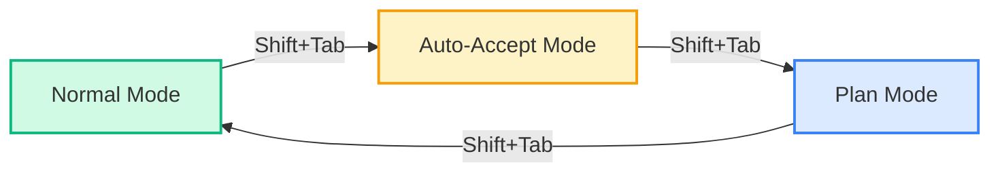

### 특수 키

| 키 | 설명 |
|---------|------|
| `Tab` | 자동 완성 / 제안 수락 |
| `/` | 명령어 또는 스킬 표시 |
| `!` | Bash 모드 (명령어 직접 실행) |
| `@` | 파일 경로 멘션 자동 완성 |
| `?` | 사용 가능한 단축키 표시 |

### VS Code 확장 전용 단축키

| 단축키 | 설명 |
|---------|------|
| `Cmd+Esc` (Mac) / `Ctrl+Esc` | 에디터 ↔ Claude 포커스 전환 |
| `Cmd+Shift+Esc` (Mac) / `Ctrl+Shift+Esc` | 새 대화를 에디터 탭으로 열기 |
| `Cmd+N` (Mac) / `Ctrl+N` | 새 대화 시작 (Claude 포커스 시) |
| `Option+K` (Mac) / `Alt+K` | @-멘션 참조 삽입 |

---

## 5. 권한 시스템

### 권한 시스템 개요

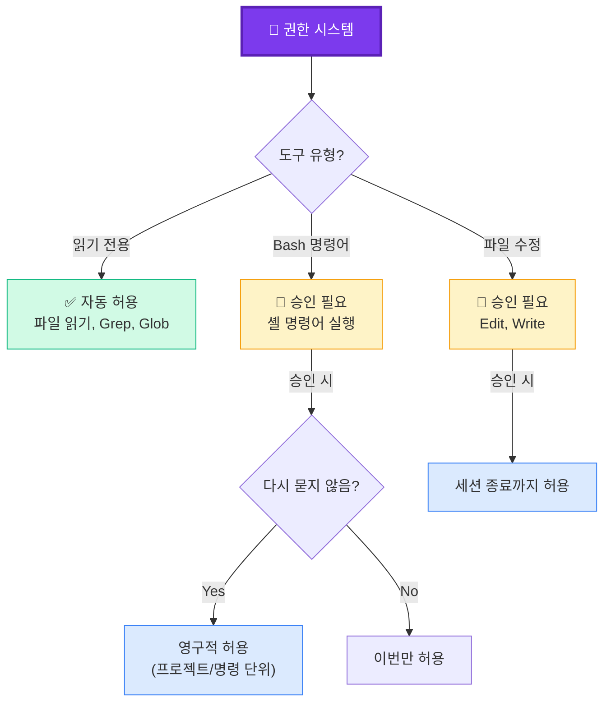

### 권한 모드

```
┌──────────────────────────────────────────────────────────────┐
│                    권한 모드 비교표                            │
├──────────────┬───────────┬───────────┬──────────────────────┤
│    모드       │ 파일 읽기  │ 파일 편집  │   Bash 명령어        │
├──────────────┼───────────┼───────────┼──────────────────────┤
│ default      │    ✅     │    🔔     │      🔔              │
│ (기본값)     │   자동    │  매번 확인 │    매번 확인          │
├──────────────┼───────────┼───────────┼──────────────────────┤
│ acceptEdits  │    ✅     │    ✅     │      🔔              │
│ (자동수락)    │   자동    │   자동    │    매번 확인          │
├──────────────┼───────────┼───────────┼──────────────────────┤
│ plan         │    ✅     │    ❌     │      ❌              │
│ (계획모드)    │   자동    │   불가    │     불가              │
├──────────────┼───────────┼───────────┼──────────────────────┤
│ bypassAll    │    ✅     │    ✅     │      ✅              │
│ (모두무시)    │   자동    │   자동    │     자동              │
│              │           │           │   ⚠️ 매우 위험!      │
└──────────────┴───────────┴───────────┴──────────────────────┘
```

### 권한 규칙 문법

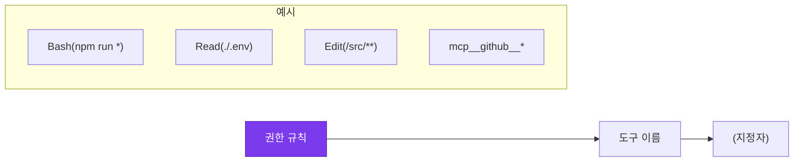

#### 도구별 규칙 예시

**Bash (셸 명령)**
```json
"allow": [
  "Bash(npm run *)",         // npm run으로 시작하는 모든 명령
  "Bash(git commit *)",      // git commit 명령
  "Bash(* --version)"       // --version 플래그 포함 명령
]
```

**Read (파일 읽기)**
```json
"allow": [
  "Read",                    // 모든 파일 읽기
  "Read(src/**)"            // src 디렉토리 내 모든 파일
],
"deny": [
  "Read(./.env)"            // .env 파일 읽기 차단
]
```

**Edit (파일 편집)**
```json
"allow": [
  "Edit(/src/**/*.ts)",     // TypeScript 파일만 편집
  "Edit(/docs/**)"          // docs 디렉토리 편집
]
```

**MCP 도구**
```json
"allow": [
  "mcp__github__*",         // GitHub 서버의 모든 도구
  "mcp__puppeteer"          // Puppeteer 서버의 모든 도구
]
```

### 권한 설정 파일 위치

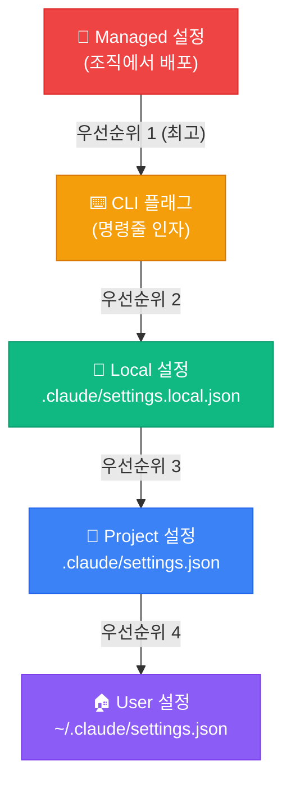

---

## 6. 프롬프트 입력 방법

### 기본 프롬프트 흐름

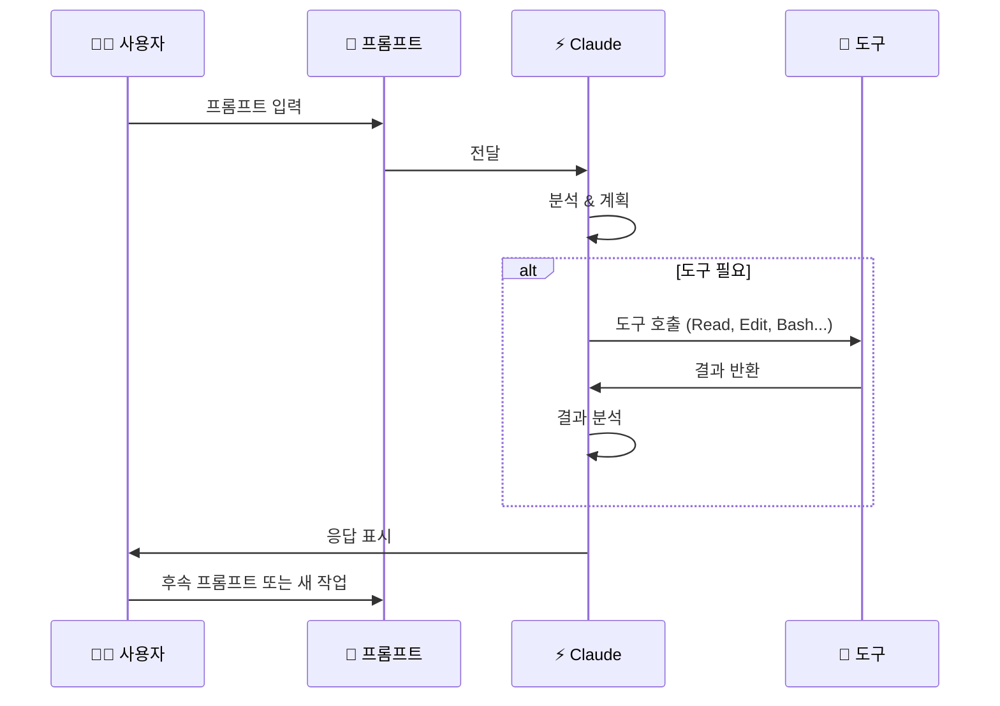

### 파일 참조 (@-멘션)

```
┌──────────────────────────────────────────────────────┐
│  📎 파일 참조 방법                                     │
├──────────────────────────────────────────────────────┤
│                                                      │
│  @src/auth.js          → 특정 파일 참조               │
│  @src/components/      → 디렉토리 참조                │
│  @app.ts#5-10          → 특정 라인 범위 참조          │
│                                                      │
│  💡 @ 입력 후 Tab으로 자동 완성!                       │
│  💡 퍼지 매칭 지원 (정확한 이름 불필요)                │
│                                                      │
│  예시:                                               │
│  > @src/auth.js에 있는 로그인 로직 설명해줘            │
│  > @src/components/ 폴더 구조가 뭐야?                 │
│  > @app.ts#5-10 이 부분 뭐 하는 거야?                 │
│                                                      │
└──────────────────────────────────────────────────────┘
```

### 이미지 입력 방법

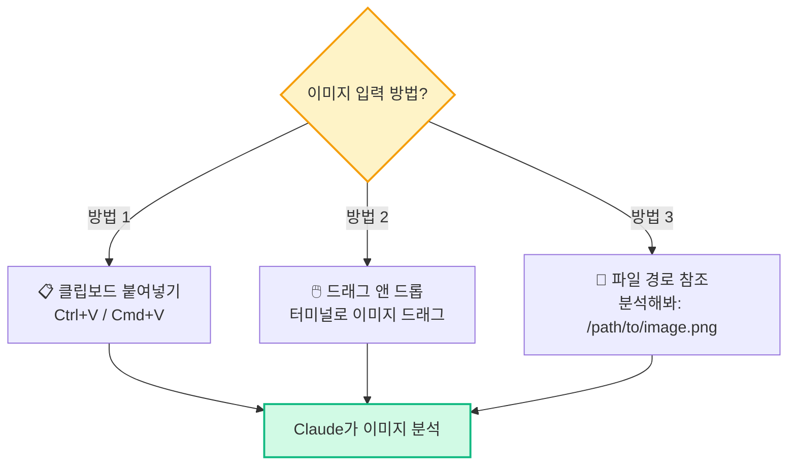

### 효과적인 프롬프트 작성 비교

```
┌─────────────────────────────────────────────────────────────┐
│                                                             │
│  ❌ 나쁜 프롬프트                    ✅ 좋은 프롬프트         │
│  ─────────────                    ──────────────           │
│                                                             │
│  "버그 고쳐줘"                     "로그인 후 빈 화면이      │
│                                   표시되는 버그 수정해줘.    │
│                                   @src/user.ts에서          │
│                                   null 체크 추가하고         │
│                                   수정 후 npm test 실행"    │
│                                                             │
│  "코드 개선해줘"                   "@src/utils.js를          │
│                                   ES 모듈 문법으로           │
│                                   리팩토링하고              │
│                                   기존 테스트 통과 확인"     │
│                                                             │
│  "새 기능 만들어"                  "사용자 프로필 페이지      │
│                                   추가해줘. React 컴포넌트   │
│                                   @src/components/ 패턴     │
│                                   따르고, API는             │
│                                   @src/api/ 형식 참고"      │
│                                                             │
└─────────────────────────────────────────────────────────────┘
```

---

## 7. MCP 서버

### MCP란?

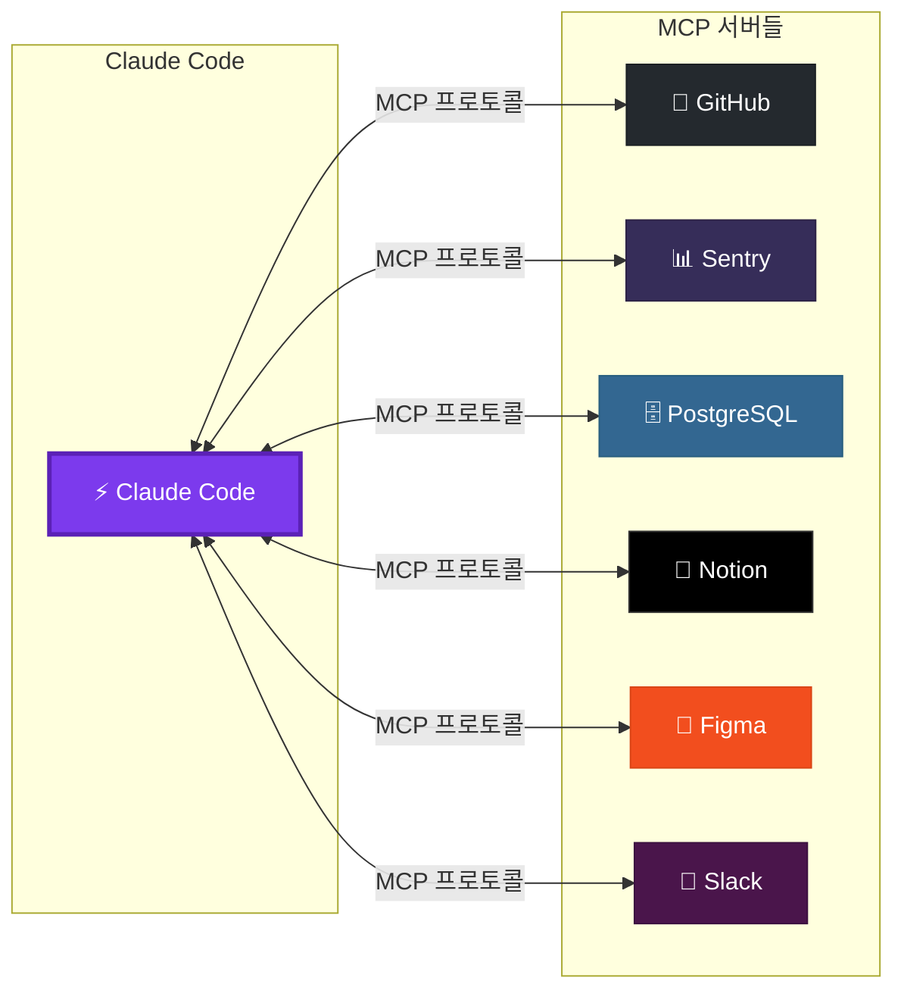

> **MCP (Model Context Protocol)** 는 Claude Code를 외부 도구, 데이터베이스, API에 연결하는 개방형 표준입니다.

### MCP 서버 설치 방법

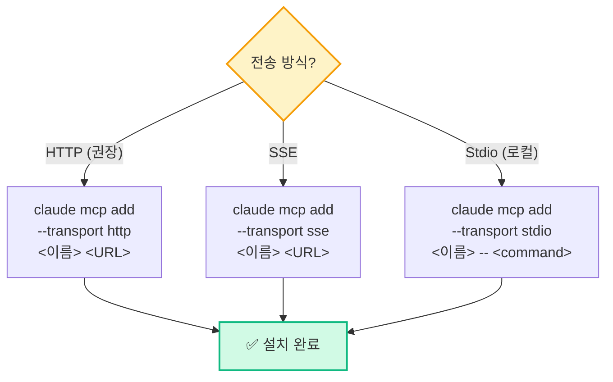

**HTTP 서버 (권장):**
```bash
# Notion 연결
claude mcp add --transport http notion https://mcp.notion.com/mcp
```

**SSE 서버:**
```bash
# Asana 연결
claude mcp add --transport sse asana https://mcp.asana.com/sse
```

**로컬 Stdio 서버:**
```bash
# Airtable 추가
claude mcp add --transport stdio \
  --env AIRTABLE_API_KEY=YOUR_KEY \
  airtable -- npx -y airtable-mcp-server
```

### MCP 서버 관리

```bash
claude mcp list              # 모든 설정된 서버 목록
claude mcp get <이름>        # 특정 서버 상세 정보
claude mcp remove <이름>     # 서버 제거
```

### 설치 범위

| 범위 | 저장 위치 | 사용 범위 | 사용 예시 |
|------|---------|---------|----------|
| **local** (기본값) | `~/.claude.json` | 현재 프로젝트만 | 개인 API 키 사용 |
| **project** | `.mcp.json` | 팀 공유 (git 커밋) | 팀 공통 도구 |
| **user** | `~/.claude.json` | 모든 프로젝트 | 개인 전역 도구 |

---

## 8. Hooks

### Hooks란?

> Hooks는 Claude Code의 수명 주기에서 특정 이벤트가 발생할 때 자동으로 실행되는 셸 명령어입니다.

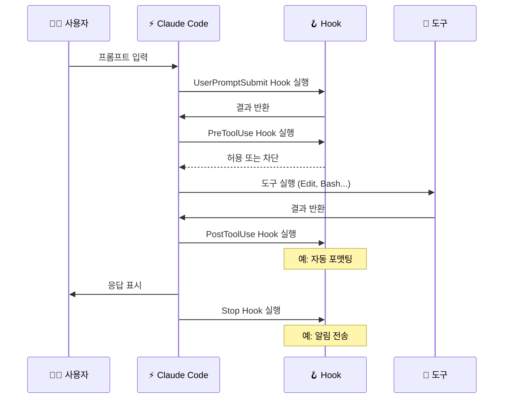

### Hook 이벤트

| 이벤트 | 언제 실행되나 | 활용 예시 |
|--------|-------------|----------|
| **SessionStart** | 세션 시작/재개 시 | 환경 설정 검증 |
| **UserPromptSubmit** | 프롬프트 제출 시 | 입력 검증 |
| **PreToolUse** | 도구 사용 전 | 차단/허용 결정 |
| **PostToolUse** | 도구 사용 성공 후 | 자동 포맷팅, 린팅 |
| **PostToolUseFailure** | 도구 사용 실패 후 | 에러 로깅 |
| **Notification** | 알림 전송 시 | 데스크톱 알림 |
| **Stop** | 응답 종료 시 | 요약 로깅 |

### Hook 설정 예시

**파일 편집 후 자동 Prettier 포맷팅:**
```json
{
  "hooks": {
    "PostToolUse": [
      {
        "matcher": "Edit|Write",
        "hooks": [
          {
            "type": "command",
            "command": "jq -r '.tool_input.file_path' | xargs npx prettier --write"
          }
        ]
      }
    ]
  }
}
```

**macOS 데스크톱 알림:**
```json
{
  "hooks": {
    "Notification": [
      {
        "matcher": "",
        "hooks": [
          {
            "type": "command",
            "command": "osascript -e 'display notification \"Claude가 주의를 필요로 합니다\" with title \"Claude Code\"'"
          }
        ]
      }
    ]
  }
}
```

---

## 9. 설정 파일

### 설정 파일 구조

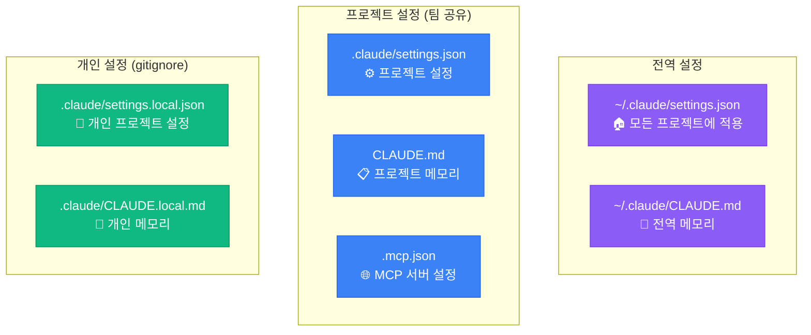

### CLAUDE.md 예시

```markdown
# 코드 스타일
- ES 모듈 문법 사용 (import/export)
- 가능하면 디스트럭처링 사용
- 세미콜론 필수

# 프로젝트 명령어
- 빌드: `npm run build`
- 테스트: `npm test`
- 린트: `npm run lint`

# 아키텍처
- src/api/ - REST API 엔드포인트
- src/services/ - 비즈니스 로직
- src/models/ - 데이터베이스 모델

# 규칙
- 코드 변경 후 반드시 타입체크 실행
- 전체 테스트 대신 관련 단일 테스트 실행
- PR 전에 lint 에러 수정 필수
```

### settings.json 예시

```json
{
  "$schema": "https://json.schemastore.org/claude-code-settings.json",
  "permissions": {
    "allow": [
      "Bash(npm run *)",
      "Bash(git commit *)",
      "Read",
      "Edit(/src/**)"
    ],
    "deny": [
      "Bash(rm -rf *)",
      "Bash(curl *)",
      "Read(./.env)"
    ]
  },
  "env": {
    "NODE_ENV": "development"
  }
}
```

---

## 10. IDE 통합

### 지원하는 IDE

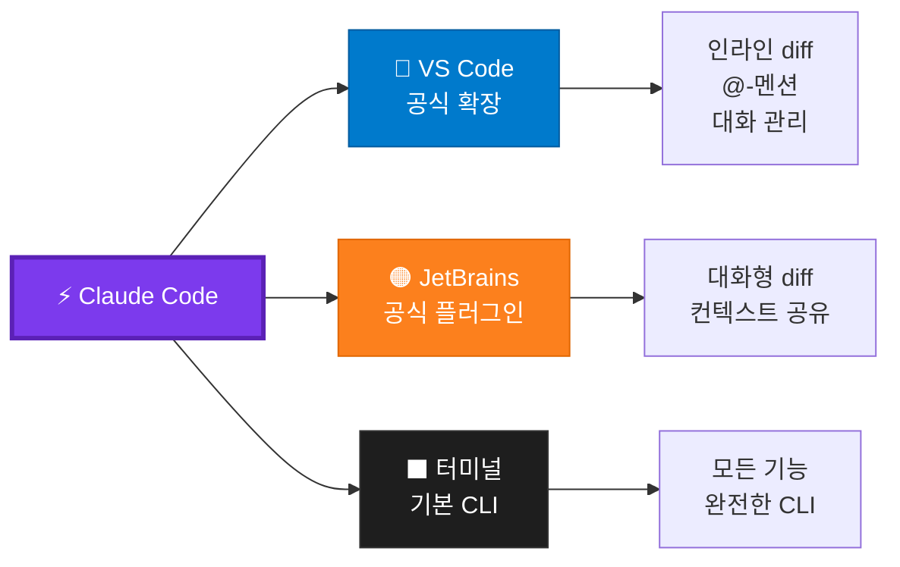

### VS Code 설치

```
VS Code → Extensions (Cmd+Shift+X) → "Claude Code" 검색 → Install
```

**VS Code에서 열기:**
1. 에디터 도구 모음의 Spark 아이콘 클릭
2. 상태 표시줄에서 "Claude Code" 클릭
3. Command Palette (`Cmd+Shift+P`) → "Claude Code" 검색

### JetBrains IDE 설치

```
JetBrains Marketplace → "Claude Code" 검색 → Install
```

**지원 IDE:** IntelliJ IDEA, PyCharm, WebStorm 등 모든 JetBrains IDE

---

## 11. 실전 워크플로우

### 코드베이스 이해하기

```mermaid
graph TD
    A["🆕 새 프로젝트 시작"] --> B["claude 실행"]
    B --> C["이 프로젝트가 뭐 하는 거야?"]
    C --> D["주요 아키텍처 패턴이 뭐야?"]
    D --> E["데이터 모델 설명해줘"]
    E --> F["인증은 어떻게 처리돼?"]
    F --> G["✅ 프로젝트 이해 완료"]

    style A fill:#FEF3C7,stroke:#F59E0B
    style G fill:#D1FAE5,stroke:#10B981
```

### 버그 수정 워크플로우

```mermaid
graph TD
    A["🐛 버그 발견"] --> B["에러 메시지 공유"]
    B --> C["Claude가 코드 분석"]
    C --> D["근본 원인 파악"]
    D --> E["수정 코드 제안"]
    E --> F["수정 적용"]
    F --> G["테스트 실행"]
    G --> H{"통과?"}
    H -->|"Yes"| I["✅ 버그 수정 완료"]
    H -->|"No"| D

    style A fill:#FEE2E2,stroke:#EF4444
    style I fill:#D1FAE5,stroke:#10B981
```

**프롬프트 예시:**
```
> npm test 실행 시 TypeError 에러 발생
> 에러: Cannot read property 'name' of undefined at UserService.js:42
> 근본 원인 찾고 고쳐줘. 수정 후 테스트 실행해줘.
```

### PR 생성 워크플로우

```mermaid
sequenceDiagram
    participant U as 🧑‍💻 사용자
    participant C as ⚡ Claude
    participant G as 🐙 GitHub

    U->>C: "변경사항 요약해줘"
    C->>C: git diff 분석
    C->>U: 변경사항 요약 표시

    U->>C: "PR 생성해줘"
    C->>C: PR 제목 & 설명 작성
    C->>G: gh pr create 실행
    G->>C: PR URL 반환
    C->>U: ✅ PR 생성 완료 + URL
```

### 테스트 작성 워크플로우

```
> @src/services/NotificationService.ts 테스트 없는 함수 찾아줘
> 그 함수들에 대한 유닛 테스트 작성해줘
> 테스트 실행하고 실패하면 고쳐줘
```

---

## 12. 초급자 팁

### 핵심 사용 원칙

```mermaid
graph TD
    A["🎯 효과적인 Claude Code 사용법"]

    A --> B["1. 구체적으로 요청"]
    A --> C["2. 작은 단위로 나눠서"]
    A --> D["3. 검증 기준 제공"]
    A --> E["4. 컨텍스트 관리"]

    B --> B1["파일명, 함수명 명시<br/>제약사항 설명<br/>기존 패턴 참조"]
    C --> C1["한 번에 하나의 작업<br/>복잡한 기능 분할<br/>점진적 구현"]
    D --> D1["테스트 실행 요청<br/>예상 결과 명시<br/>edge case 포함"]
    E --> E1["/clear로 초기화<br/>/compact로 요약<br/>CLAUDE.md 활용"]

    style A fill:#7C3AED,stroke:#5B21B6,color:white,stroke-width:3px
    style B fill:#DBEAFE,stroke:#3B82F6
    style C fill:#D1FAE5,stroke:#10B981
    style D fill:#FEF3C7,stroke:#F59E0B
    style E fill:#FEE2E2,stroke:#EF4444
```

### 초급자가 하는 흔한 실수

| 실수 | 왜 문제인가 | 해결책 |
|------|-----------|-------|
| 너무 긴 대화 진행 | 컨텍스트 오염, 성능 저하 | `/clear`로 정기적으로 초기화 |
| 같은 문제 반복 수정 | 비효율적, 토큰 낭비 | 더 명확한 초기 프롬프트로 다시 시작 |
| 과도하게 긴 CLAUDE.md | Claude가 중요 지시사항 놓침 | 간결하게 유지, 핵심만 |
| 검증 없이 코드 수락 | 버그/회귀 위험 | 항상 테스트/검증 방법 제공 |
| 계획 없이 대규모 변경 | 잘못된 방향으로 진행 | Plan Mode 사용 (`Shift+Tab`) |
| MCP 서버 과다 설정 | 성능 저하 | 정말 필요한 것만 연결 |

### 컨텍스트 관리 전략

```mermaid
graph LR
    A["💬 대화 시작"] --> B["작업 진행"]
    B --> C{"컨텍스트<br/>50% 이상?"}
    C -->|"Yes"| D["/compact로 요약"]
    C -->|"No"| B
    D --> B

    B --> E{"새 작업?"}
    E -->|"관련 없는 작업"| F["/clear로 초기화"]
    E -->|"관련 있는 작업"| B
    F --> A

    style C fill:#FEF3C7,stroke:#F59E0B
    style D fill:#DBEAFE,stroke:#3B82F6
    style F fill:#FEE2E2,stroke:#EF4444
```

### CLAUDE.md 작성 가이드

```
┌────────────────────────────────────────────────┐
│                                                │
│  ✅ 포함해야 할 것         ❌ 제외할 것          │
│  ────────────────         ──────────           │
│                                                │
│  빌드/테스트 명령어        코드에서 파악 가능한 것  │
│  코드 스타일 규칙          자주 변경되는 정보      │
│  아키텍처 결정사항         긴 설명이나 튜토리얼    │
│  프로젝트 특정 용어        일반적인 프로그래밍 규칙 │
│  특이한 패턴 설명                               │
│                                                │
└────────────────────────────────────────────────┘
```

---

## 참고 영상 자료

아래 영상들을 통해 Claude Code의 실제 사용법을 시각적으로 학습할 수 있습니다:

### 공식 자료

| 자료 | 링크 | 설명 |
|------|------|------|
| Anthropic 공식 문서 | [code.claude.com/docs](https://code.claude.com/docs) | 최신 공식 문서 |
| Claude Code 소개 영상 | [YouTube - Anthropic](https://www.youtube.com/anthropic) | 공식 소개 영상 |

### 추천 학습 순서

```mermaid
graph TD
    A["1️⃣ 설치 & 첫 실행"] -->|"이 가이드 섹션 1"| B["2️⃣ 기본 프롬프트 연습"]
    B -->|"이 가이드 섹션 6"| C["3️⃣ CLAUDE.md 작성"]
    C -->|"/init 실행"| D["4️⃣ 권한 설정"]
    D -->|"/permissions"| E["5️⃣ 실전 워크플로우"]
    E -->|"이 가이드 섹션 11"| F["6️⃣ MCP & Hooks"]
    F -->|"이 가이드 섹션 7-8"| G["7️⃣ IDE 통합"]
    G --> H["🎓 마스터!"]

    style A fill:#EF4444,stroke:#DC2626,color:white
    style B fill:#F59E0B,stroke:#D97706,color:white
    style C fill:#10B981,stroke:#059669,color:white
    style D fill:#3B82F6,stroke:#2563EB,color:white
    style E fill:#8B5CF6,stroke:#7C3AED,color:white
    style F fill:#EC4899,stroke:#DB2777,color:white
    style G fill:#6366F1,stroke:#4F46E5,color:white
    style H fill:#14B8A6,stroke:#0D9488,color:white
```

---

## 빠른 참조 치트시트

> 자세한 치트시트는 [CHEATSHEET.md](./CHEATSHEET.md)를 참조하세요.

### 가장 많이 쓰는 명령어 TOP 10

| # | 명령어/단축키 | 목적 |
|---|------------|------|
| 1 | `/clear` | 새 작업 시작 |
| 2 | `/compact` | 컨텍스트 절약 |
| 3 | `Shift+Tab` | 권한 모드 전환 |
| 4 | `@파일명` | 파일 참조 |
| 5 | `/model` | 모델 변경 |
| 6 | `/cost` | 토큰 사용량 확인 |
| 7 | `Ctrl+C` | 생성 취소 |
| 8 | `/resume` | 이전 세션 재개 |
| 9 | `!명령어` | Bash 직접 실행 |
| 10 | `/help` | 도움말 |

---

<p align="center">
  <i>이 가이드가 도움이 되었다면 ⭐ Star를 눌러주세요!</i>
</p>

<p align="center">
  
</p>
