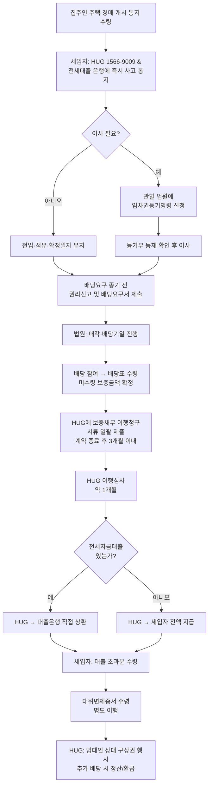

# HUG 전세보증금반환보증 이행청구 워크플로우 매뉴얼

> **대상 시나리오**: 전세자금대출을 받아 입주한 세입자가, HUG(주택도시보증공사) **전세보증금반환보증**에 가입한 상태에서 **집주인의 주택이 경매로 넘어가** 보증금을 돌려받지 못하게 된 경우.
>
> **면책**: 본 문서는 공개된 일반 안내 자료를 바탕으로 정리한 실무 참고용 매뉴얼이며, 법률 자문이 아닙니다. 실제 청구 시에는 HUG 공식 안내(콜센터 1566-9009), 관할 법원, 대한법률구조공단, 변호사 상담을 반드시 병행하십시오.

---

## 1. 개요 — 어떤 "보증사고"에 해당하는가

HUG 전세보증금반환보증의 보증사고는 두 가지로 나뉩니다.

| 구분 | 유형 | 요건 |
|---|---|---|
| **1호 사고** | 계약 종료 후 미반환 | 전세계약 **해지·종료 후 1개월 내**에 정당한 사유 없이 보증금을 돌려받지 못한 경우 |
| **2호 사고** | 경매·공매 미수령 | 전세계약 **기간 중** 전세목적물에 대한 **경매 또는 공매**가 실시되어 **배당 후에도** 전세보증금을 회수하지 못한 경우 |

**본 매뉴얼은 2호 사고(경매)** 기준으로 작성되었습니다.

### 1.1 반환보증과 대출상환보증의 차이

| 구분 | 반환보증 | 대출상환보증(전세금안심대출보증 등) |
|---|---|---|
| 보호 대상 | 세입자 | 대출 은행 |
| 효과 | HUG가 집주인 대신 세입자에게 보증금 반환 | 세입자가 대출 못 갚을 때 HUG가 은행에 대신 상환 |
| 본 시나리오 | **필요** | 가입되어 있으면 별도 절차 병행 |

전세자금대출을 받은 세입자는 보통 **반환보증 + 대출상환보증**이 함께 묶여 있습니다. 가입한 상품 구성을 반드시 확인하세요.

---

## 2. 핵심 용어 정리

- **대위변제(代位辨濟)**: HUG가 임대인을 대신해 세입자(또는 대출은행)에게 보증금을 먼저 지급하는 행위.
- **임차권등기명령**: 계약 종료 후에도 보증금을 못 받은 상태로 **이사(전출)**해야 할 때, 대항력·우선변제권을 유지하기 위해 법원에 신청하는 등기.
- **배당요구**: 경매 절차에서 매각대금 중 일부를 받기 위해 법원에 **배당요구 종기 전까지** 권리신고서와 함께 제출하는 절차.
- **채권양도**: 세입자가 임대인에게 가진 보증금반환채권을 HUG에 넘기는 계약. 이행청구의 **필수 전제**.
- **명도(明渡)**: 대위변제금 수령을 위해 주택을 실제로 비워 HUG/매수인 측에 인도하는 것.
- **구상권**: HUG가 대위변제 후 임대인에게 돈을 돌려받을 권리.

---

## 3. 단계별 워크플로우 (경매 시나리오)

| # | 담당 | 업무 | 기한·포인트 |
|---:|---|---|---|
| 1 | 세입자 | 법원으로부터 **경매개시결정** 통지 수령. 즉시 HUG(1566-9009)와 전세자금대출 은행에 **사고 통지** | 통지 수령 즉시 |
| 2 | 세입자 | 관할 집행법원에 **권리신고 및 배당요구서** 제출 (확정일자 전세계약서 사본·주민등록등본 첨부) | **배당요구 종기까지** (놓치면 배당 불가) |
| 3 | 세입자 | **전입·점유·확정일자** 유지 — 대항력·우선변제권 보존 | 배당기일까지 |
| 4 | 세입자 | 이사가 불가피하면 관할 법원에 **임차권등기명령** 신청 → 등기부에 등재 확인 **후** 이사 | 신청~결정 약 2주 |
| 5 | 법원 | 매각기일·배당기일 진행, 배당표 작성 | — |
| 6 | 세입자 | 배당기일 출석(또는 위임) → **배당표 사본** 확보하여 **미수령 보증금액** 확정 | 배당기일 후 즉시 |
| 7 | 세입자 | HUG에 **보증채무 이행청구서**와 서류 일괄 제출 (모바일HUG 또는 영업점) | **전세계약 종료 후 3개월 이내** |
| 8 | HUG | **이행심사** — 서류, 대항력, 사고사유 검증 | 통상 접수 후 약 1개월 |
| 9 | HUG | **대위변제 실행**. 전세자금대출이 있는 경우 **대출은행으로 직접 상환**하고 세입자는 **대출 초과분(잔액)**만 수령 | 이행청구 후 1개월 내 목표 |
| 10 | 세입자 | **대위변제증서** 수령 → **명도 이행**(집을 비움) → 이행금액 실수령 | 명도 완료 시 |
| 11 | HUG | 임대인에 대한 **구상권** 행사. 이후 추가 배당금이 들어오면 세입자·은행과 **정산/환급** | 사후 |

---

## 4. HUG가 요구하는 제출 서류 (경매 2호 사고)

- [ ] **보증채무이행청구서** (HUG 양식)
- [ ] 신분증 사본
- [ ] 주민등록등본 **또는** 초본 (말소자 포함)
- [ ] **확정일자부 전세계약서 원본**
- [ ] 인감증명서 및 인감도장
- [ ] **임차권등기명령 결정문**
- [ ] 임차권등기가 **등재된 등기부등본**
- [ ] 전세계약의 **해지·종료를 증명**하는 서류(내용증명, 합의서 등)
- [ ] **배당표 사본** 등 전세보증금 중 미수령액을 증명하는 서류
- [ ] **채권양도계약서** 및 양도통지(내용증명) 증명 — 가입 시점에 양도 안 했다면 **청구 전에 반드시** 실시
- [ ] (전세자금대출이 있는 경우) **대출 잔액증명서**, 은행 상환계좌 정보, 대출약정서 사본

> 서류 목록은 사건별로 추가될 수 있으므로, 접수 전 HUG 콜센터(1566-9009) 또는 모바일HUG 안내를 최종 확인하십시오.

---

## 5. 전세자금대출 연계 시 주의사항

1. **대출금 상환은 HUG → 은행 직접 입금**이 원칙입니다. 세입자는 전체 보증금에서 대출 잔액을 제외한 **차액만** 실제로 받게 됩니다.
2. **이자는 대위변제 시점까지 계속 발생**합니다. 경매 사실을 안 즉시 **은행·HUG 양쪽 모두**에 통지해 이자 불이익을 최소화하세요.
3. 가입 상품이 **반환보증 단독**인지, **전세금안심대출보증(반환+상환 결합)**인지 확인하세요. 결합 상품이면 별도 상환보증 절차가 병행됩니다.
4. 전세대출을 중도 상환하거나 갱신하려 할 때 **경매 개시 후** 임의로 처리하지 말고 반드시 은행·HUG와 협의하십시오.

---

## 6. 세입자 체크리스트 (Do / Don't)

### ❗ 절대 하지 말 것
- 임차권등기 **없이** 전출(이사) → 대항력 상실
- 경매 진행 중 **점유 해제** 또는 **주소지 변경**
- 배당요구 종기 **경과 후** 신고 시도
- 임대인과 **사적 합의**로 보증금 일부 수령하며 권리 포기

### ✅ 반드시 할 것
- 경매개시결정문 수령 즉시 **HUG·은행 동시 통지**
- **배당요구** 기한 내 제출
- 계약서·내용증명·등기부등본 등 **모든 원본 보관 및 사본 스캔**
- **계약 종료 후 3개월 이내** HUG 이행청구 접수
- 이행심사 기간 중에도 **연락 가능한 연락처 유지**

---

## 7. 워크플로우 플로우차트

---

## 8. 연락처 · 공식 참고 링크

- **HUG 콜센터**: 1566-9009
- **모바일HUG 이행청구**: <https://onestop.khug.or.kr/webView/webBiz/excu/loahExcu001>
- **보증이행 안내 (공식)**: <https://www.khug.or.kr/hug/web/ge/er/geer001200.jsp>
- **보증사고 유형 설명**: <https://www.khug.or.kr/hug/web/ge/er/geer001100.jsp>
- **이용절차 및 제출서류**: <https://www.khug.or.kr/hug/web/ig/dr/igdr000002.jsp>
- **임차권등기명령 안내 (찾기쉬운 생활법령정보)**: <https://easylaw.go.kr/CSP/CnpClsMain.laf?popMenu=ov&csmSeq=629&ccfNo=5&cciNo=2&cnpClsNo=1>

---

_최종 작성일: 2026-04-12_
