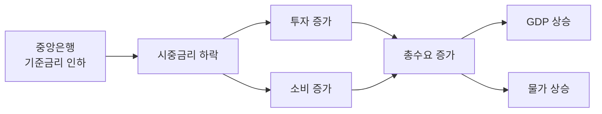

# 경제학 시각화 스킬

경제학 질문에는 **답변 = 시각 자료 + 짧은 해설** 형태로 응답한다. 텍스트로만 끝내지 않는다.

## 기본 규칙

- 라벨·축·범례는 **한글**. 수식은 LaTeX(`$$ ... $$`).
- 모델 그래프(수요공급, IS-LM 등)는 **matplotlib**.
- 인과·순환·구조 설명은 **Mermaid**.
- 비교·장단점·시나리오는 **표 + 인라인 다이어그램**.
- 발표/강의 요청은 **PPTX**(`skills/pptx`).
- 시계열·실증 그래프는 출처 데이터가 있어야 함. 없으면 **"시뮬레이션 예시"** 라벨 명시.

## 형식 선택 워크플로

| 질문 유형 | 1차 도구 | 예시 |
|---|---|---|
| 단일 모델 곡선 | matplotlib | 수요공급, IS-LM 균형 이동 |
| 인과/순환 설명 | Mermaid flowchart | 통화정책 전달경로, 경제순환 |
| 분류·계층 구조 | Mermaid graph | 시장구조 4분류, 재정정책 도구 |
| 비교 분석 | 표 + 인라인 SVG | 케인지언 vs 통화주의자 |
| 시계열 실증 | matplotlib (출처 명시) | GDP, CPI, 환율 추이 |
| 발표 자료 | PPTX | 강의 슬라이드, 보고서 |
| 보수/효용 행렬 | matplotlib heatmap | 게임이론 보수행렬, 비교정학 |

상세 카탈로그는 [references/economic-graphs.md](references/economic-graphs.md) 참고.

## 한글 폰트 폴백 (matplotlib 필수 보일러플레이트)

코드를 생성할 때 **항상 다음을 가장 먼저** 포함시킨다. 없으면 한글 깨짐.

```python
import matplotlib.pyplot as plt
import matplotlib.font_manager as fm

_KR_FONT_CANDIDATES = ["Noto Sans CJK KR", "NanumGothic", "Malgun Gothic", "AppleGothic", "Apple SD Gothic Neo"]
_installed = {p.name for p in fm.fontManager.ttflist}
for _f in _KR_FONT_CANDIDATES:
    if _f in _installed:
        plt.rcParams["font.family"] = _f
        break
plt.rcParams["axes.unicode_minus"] = False
```

설치 안 된 환경에서는 사용자에게 `apt install fonts-noto-cjk` 또는 `pip install nanum-font` 안내. 자세한 색상·스타일은 [references/palette-and-style.md](references/palette-and-style.md).

## 모델 그래프 빠른 템플릿

### 1) 수요공급 균형 이동 (가장 자주 쓰임)

```python
import numpy as np
import matplotlib.pyplot as plt

q = np.linspace(0, 10, 200)
demand  = 10 - 0.8 * q          # P = 10 - 0.8Q
demand2 = 12 - 0.8 * q          # 수요 증가 (오른쪽 이동)
supply  = 2 + 0.6 * q           # P = 2 + 0.6Q

fig, ax = plt.subplots(figsize=(6, 4.5))
ax.plot(q, demand,  label="수요 D",  color="#1f77b4")
ax.plot(q, demand2, label="수요' D′ (증가)", color="#1f77b4", linestyle="--")
ax.plot(q, supply,  label="공급 S",  color="#d62728")

# 균형점
eq_q,  eq_p  = (10 - 2) / (0.8 + 0.6), 2 + 0.6 * (10 - 2) / (0.8 + 0.6)
eq2_q, eq2_p = (12 - 2) / (0.8 + 0.6), 2 + 0.6 * (12 - 2) / (0.8 + 0.6)
ax.scatter([eq_q, eq2_q], [eq_p, eq2_p], color="black", zorder=5)
ax.annotate(f"E", (eq_q,  eq_p),  textcoords="offset points", xytext=(6, 6))
ax.annotate(f"E′", (eq2_q, eq2_p), textcoords="offset points", xytext=(6, 6))

ax.set_xlabel("수량 Q")
ax.set_ylabel("가격 P")
ax.set_title("수요 증가에 따른 균형 이동")
ax.legend(loc="upper right")
ax.set_xlim(0, 10); ax.set_ylim(0, 12)
ax.grid(True, alpha=0.3)
plt.tight_layout()
plt.savefig("supply_demand_shift.svg")
```

### 2) IS-LM 균형

```python
import numpy as np
import matplotlib.pyplot as plt

Y = np.linspace(0, 100, 200)
IS = 12 - 0.10 * Y              # 재화시장
LM = 2  + 0.08 * Y              # 화폐시장

fig, ax = plt.subplots(figsize=(6, 4.5))
ax.plot(Y, IS, label="IS", color="#2ca02c")
ax.plot(Y, LM, label="LM", color="#ff7f0e")
y_star = (12 - 2) / (0.10 + 0.08)
r_star = 12 - 0.10 * y_star
ax.scatter([y_star], [r_star], color="black", zorder=5)
ax.annotate(f"균형 (Y*={y_star:.1f}, r*={r_star:.2f})", (y_star, r_star),
            textcoords="offset points", xytext=(8, 8))
ax.set_xlabel("국민소득 Y"); ax.set_ylabel("이자율 r")
ax.set_title("IS-LM 균형")
ax.legend(); ax.grid(True, alpha=0.3)
plt.tight_layout()
```

다른 모델(AD-AS, Phillips, Laffer, 무차별곡선)은 [references/economic-graphs.md](references/economic-graphs.md).

## Mermaid 도식 빠른 템플릿



더 많은 패턴(시장구조 분류, 경제순환, 재정정책 전달)은 [references/mermaid-patterns.md](references/mermaid-patterns.md).

## 절대 하지 말 것

- 데이터 없이 시계열 그리기. 시뮬레이션이면 차트 제목에 명시.
- 한글 폰트 설정 빠뜨리기 (위 보일러플레이트 필수).
- 음수 부호(−)가 깨지면 `axes.unicode_minus=False` 안 한 것.
- 모든 차트에 무지개색 쓰기. 한 도메인 = 한 톤(파랑 계열 권장).
- 텍스트 답변만 내고 시각 자료 생략.

## 출력 체크리스트

답변 보내기 전:

- [ ] 차트 또는 도식 최소 1개 포함
- [ ] 한글 라벨 정상 (음수 부호 포함)
- [ ] 데이터 출처 또는 "시뮬레이션 예시" 명시
- [ ] 모델 가정 한 줄 (예: "선형 수요/공급 가정")
- [ ] 한 문단 이내 해설
