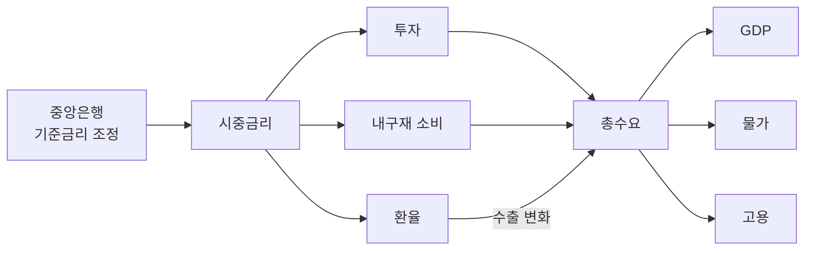
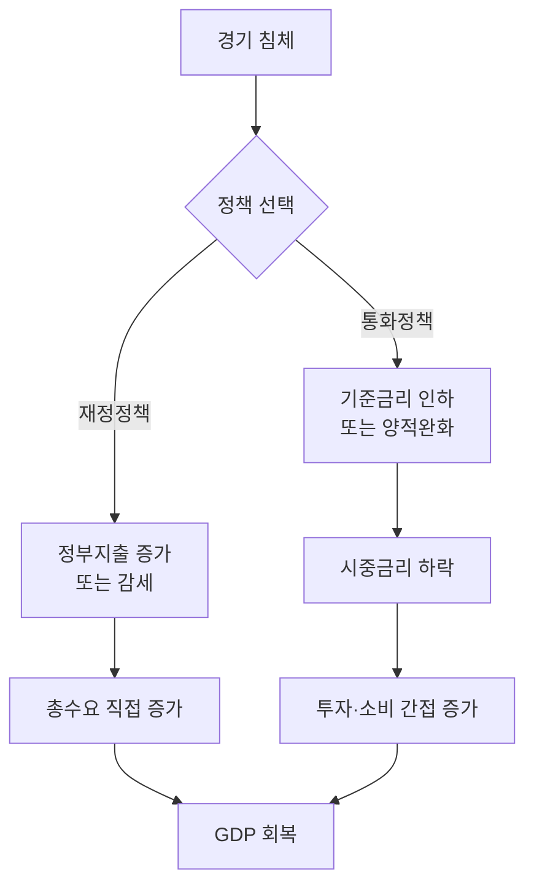
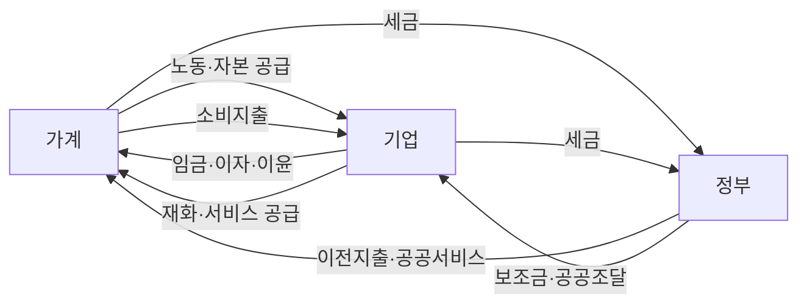
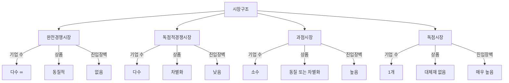
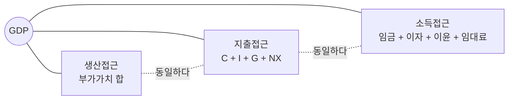
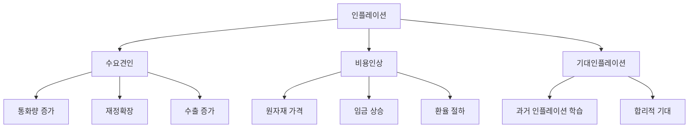
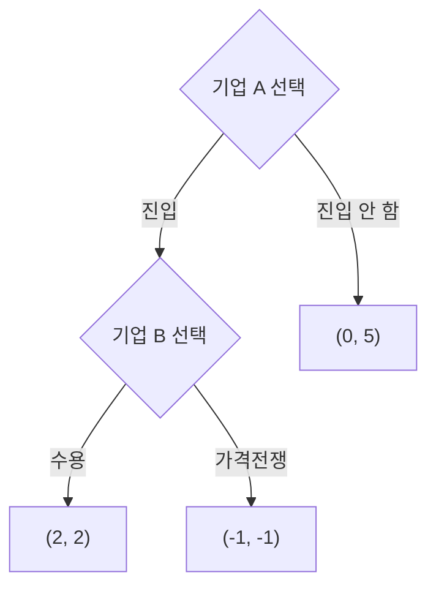

# Mermaid 도식 패턴 (경제학)

GitHub, Notion, 대부분의 Markdown 뷰어에서 자동 렌더링.

## 1. 통화정책 전달경로 (가장 자주 쓰임)



## 2. 재정정책 vs 통화정책 비교



## 3. 경제순환 (가계-기업-정부)



## 4. 시장구조 4분류



## 5. GDP 측정 3접근



## 6. 인플레이션 원인 분류



## 7. 게임이론 의사결정 트리



각 노드의 보수는 `(A의 보수, B의 보수)` 형식.

## 8. 외부효과 — 사적·사회적 비용

```mermaid
flowchart LR
    Q[생산량 결정] --> PMC[사적 한계비용 PMC]
    Q --> SMC[사회적 한계비용 SMC]
    PMC --> QP[사적 균형 Q_p]
    SMC --> QS[사회적 최적 Q_s]
    QP -.|Q_p > Q_s| DWL[과잉생산<br/>사중손실]
    DWL --> Tax[피구세 / 배출권]
    Tax --> QS
```

## 사용 가이드

- 노드는 **한글 + 기호** 형식: `[총수요 AD]`, `[GDP Y]`.
- 화살표 라벨은 `-->|증가|`, `-->|하락|` 으로 방향성 명시.
- 인과 관계: `-->`. 동치/항등 관계: `-.동일하다.-`.
- 박스 모양으로 의미 구분:
  - `[직사각형]` — 변수/상태
  - `((원형))` — 합산/총량
  - `{마름모}` — 의사결정 분기
  - `[(파일)]` — 데이터/통계
