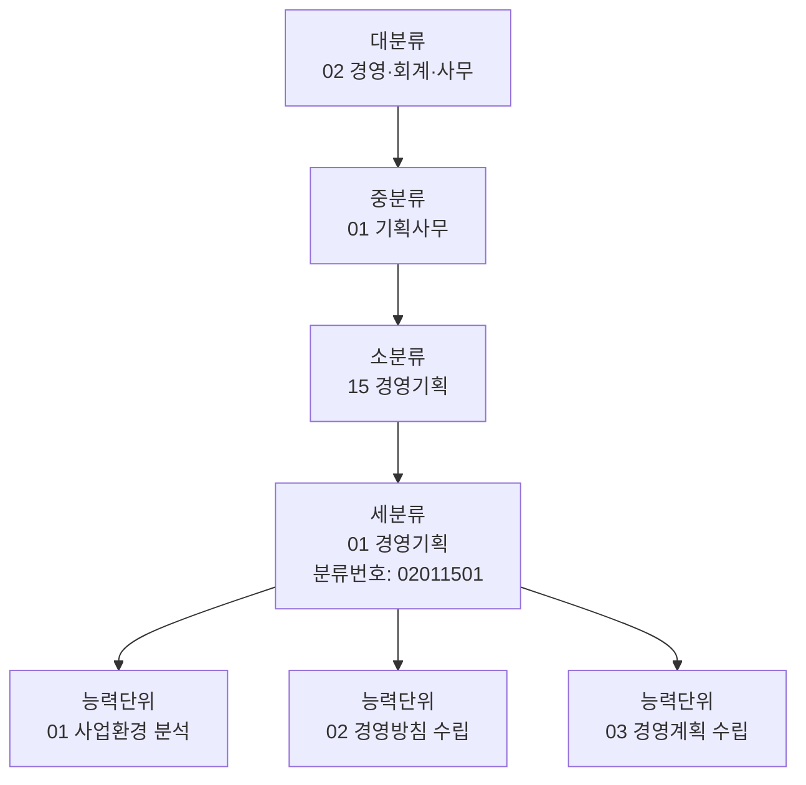

# NCS 시각화 스킬

NCS 관련 질문은 답변을 반드시 **시각 자료 + 짧은 해설**로 구성한다. NCS는 본질적으로 **계층 구조 + 매트릭스**라서 텍스트만으로는 항상 부족하다.

## 기본 규칙

- 라벨은 **NCS 공식 용어** 그대로. 임의 번역·축약 금지.
- 분류체계 표현은 **Mermaid 트리** 우선.
- 능력단위요소 ↔ 수행준거 관계는 **표(매트릭스)**.
- 학습모듈 학습 흐름은 **Mermaid flowchart**.
- 수준별·기간별 비교는 **matplotlib**.
- 직무분석 보고서·발표는 **PPTX** (`skills/pptx`).

## NCS 분류체계 (이건 무조건 기억)

```
대분류 (24개)
 └─ 중분류 (80개)
     └─ 소분류 (257개)
         └─ 세분류 (1,022개)  ← 여기까지가 "직무"
             └─ 능력단위 (다수)
                 └─ 능력단위요소
                     └─ 수행준거
```

분류번호 8자리 형식: `LLMMSSDD`
- LL: 대분류 (2자리)
- MM: 중분류 (2자리)
- SS: 소분류 (2자리)
- DD: 세분류 (2자리)

예: `02011501` = 경영·회계·사무(02) > 기획사무(01) > 경영기획(15) > 경영기획(01)

## 형식 선택 워크플로

| 질문 유형 | 1차 도구 | 예시 |
|---|---|---|
| "○○ 직무 능력단위 보여줘" | Mermaid 트리 | 세분류 → 능력단위 펼치기 |
| "○○ 능력단위 분해해줘" | Mermaid + 표 | 능력단위 → 요소 → 수행준거 |
| "수행준거 vs 능력단위요소 매핑" | 표 (매트릭스) | 행: 요소, 열: 수행준거 |
| "학습모듈 어떻게 진행?" | Mermaid flowchart | 모듈 순서·선수 관계 |
| "직무 수준 분포" | matplotlib bar/box | 1~8수준 분포 |
| "유사 직무 비교" | 표 + Mermaid | 능력단위 중첩 표시 |
| "직무분석 발표 자료" | PPTX | 분석 결과 슬라이드 |

상세 패턴은 [references/mermaid-templates.md](references/mermaid-templates.md), [references/competency-matrix.md](references/competency-matrix.md).

## 빠른 템플릿 — 능력단위 계층



각 능력단위를 더 펼치고 싶으면 [references/mermaid-templates.md](references/mermaid-templates.md)의 "능력단위 ↔ 요소 ↔ 수행준거" 패턴.

## 빠른 템플릿 — 수행준거 매트릭스

| 능력단위요소 \\ 수행준거 | 1.1 환경 분석 절차 수립 | 1.2 정보 수집 | 1.3 분석 결과 도출 |
|---|---|---|---|
| 1. 사업환경 분석 절차 수립하기 | ✅ | | |
| 2. 사업환경 정보 수집하기 | | ✅ | |
| 3. 사업환경 분석 수행하기 | | | ✅ |

상세 작성법: [references/competency-matrix.md](references/competency-matrix.md).

## 데이터 출처

NCS 자료는 임의 추정 금지. 다음 중 하나에서 인용:

- **NCS 공식 사이트**: https://www.ncs.go.kr
- **NCS 분류체계 검색**: https://www.ncs.go.kr/unity/th01/ncsSearchMain.do
- **능력단위 PDF**: 공식 사이트에서 직무별 다운로드
- **학습모듈**: 한국산업인력공단 e-NCS 학습관리시스템

답변할 때 출처와 **개정 연도** 명시 (예: "2024년 개정 NCS 기준").

## 절대 하지 말 것

- 분류번호·능력단위명 임의 생성. 모르면 "확인 필요" 명시.
- "NCS 1수준 = 초급" 같은 단순화. 수준은 8단계 체계로 정의됨.
- 능력단위요소를 영어로 번역. 한글 공식 명칭 유지.
- 학습모듈 시간을 추정. 공식 자료 인용 필수.
- 수행준거를 능력단위와 혼동. 위계 관계가 다르다.

## 출력 체크리스트

답변 전:

- [ ] Mermaid 또는 표 최소 1개
- [ ] NCS 분류번호 명시(해당되면)
- [ ] 개정 연도 명시
- [ ] 출처 (`www.ncs.go.kr` 또는 PDF명)
- [ ] 능력단위·요소·수행준거 위계 정확
