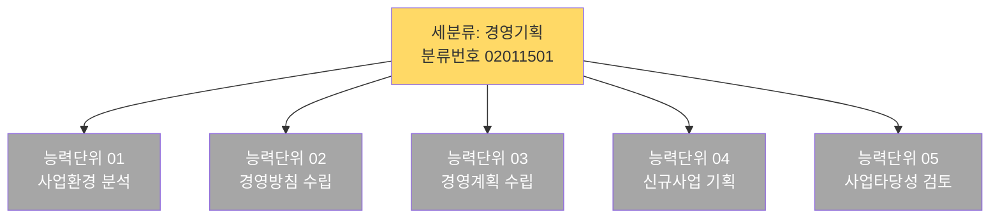
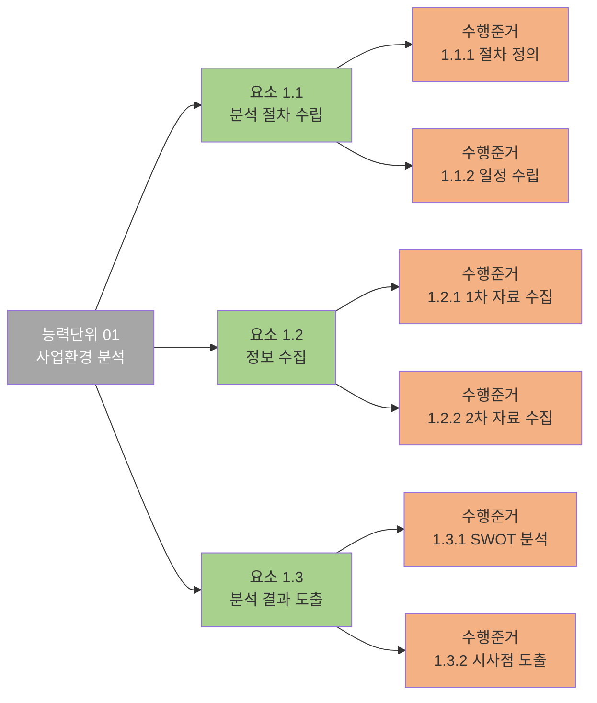
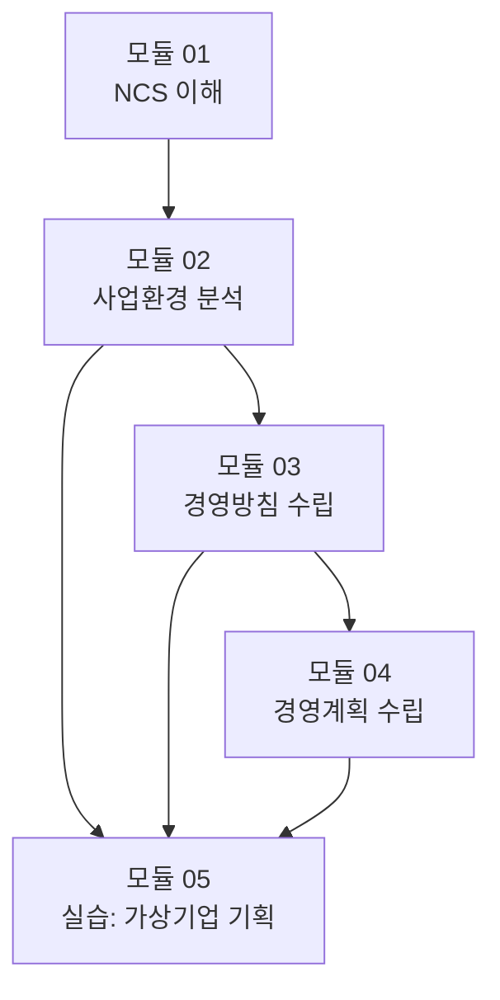
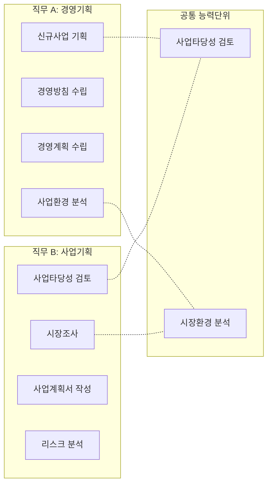
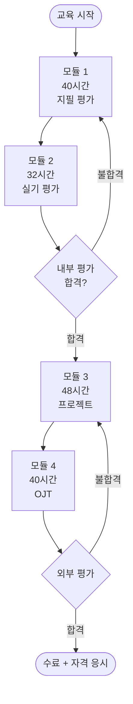
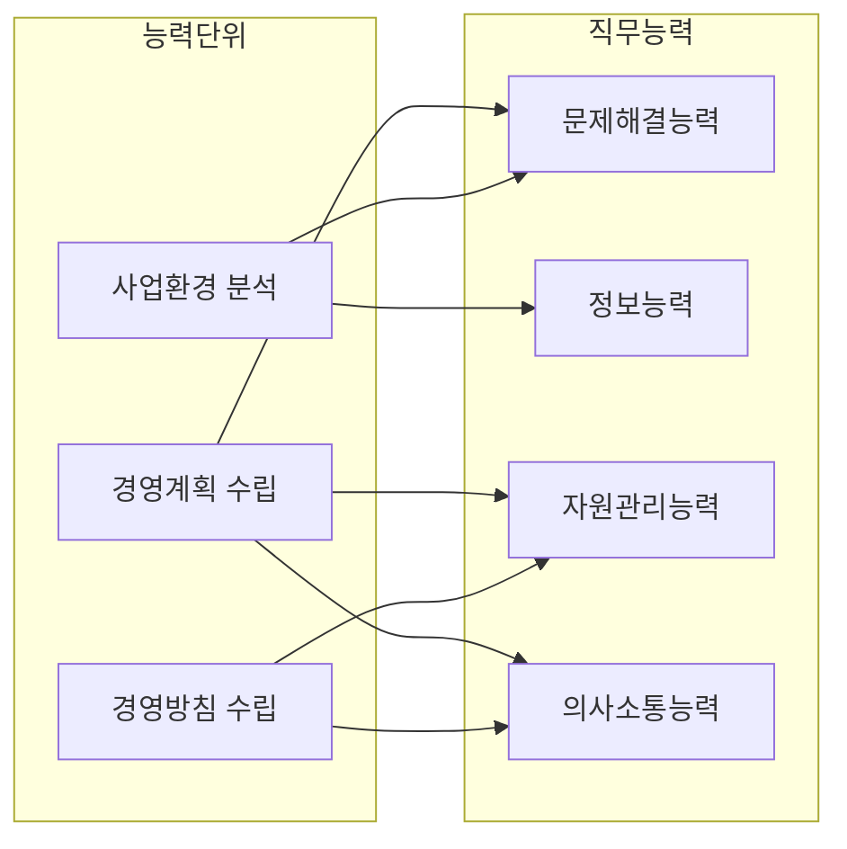
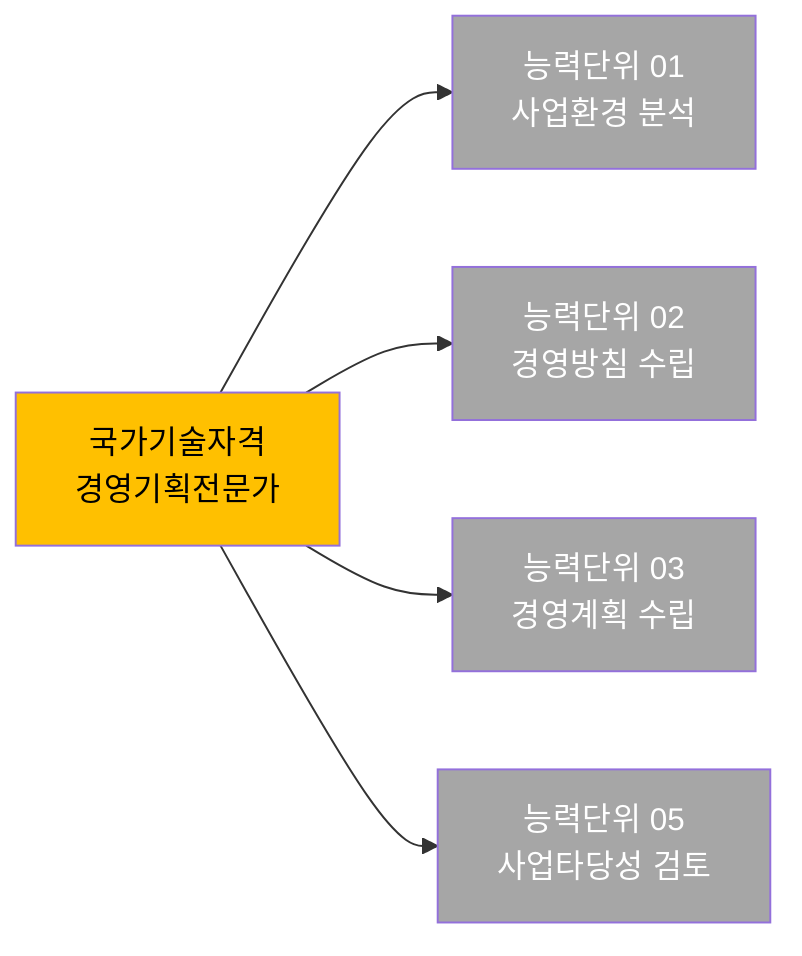

# NCS Mermaid 템플릿 모음

[ncs-hierarchy.md](ncs-hierarchy.md)의 색상 클래스를 재사용.

## 1. 직무 전체 능력단위 트리 (가장 자주 쓰임)

## 2. 능력단위 → 요소 → 수행준거 (3단 펼침)

## 3. 학습모듈 흐름 (선수관계 포함)

선수 관계가 복잡하면 `flowchart LR`로 가로 배치.

## 4. 두 직무 능력단위 중첩 (유사 직무 비교)

`-.-` (점선)으로 공유 관계 표현.

## 5. NCS 기반 과정 설계 (학습기간 + 평가)

## 6. 능력단위 ↔ 직무능력 매핑

## 7. 자격증 ↔ NCS 능력단위 매핑

## 사용 가이드

- 노드는 **공식 명칭** 그대로. 약어 금지.
- 분류번호는 노드 안에 한 줄로 표시 (` 분류번호 02011501`).
- `subgraph`로 그룹화 시 그룹 이름도 한글.
- 색상은 `ncs-hierarchy.md` 클래스 재사용.
- 25개 이상 노드면 `flowchart TB` 대신 `subgraph` 분할 권장.
