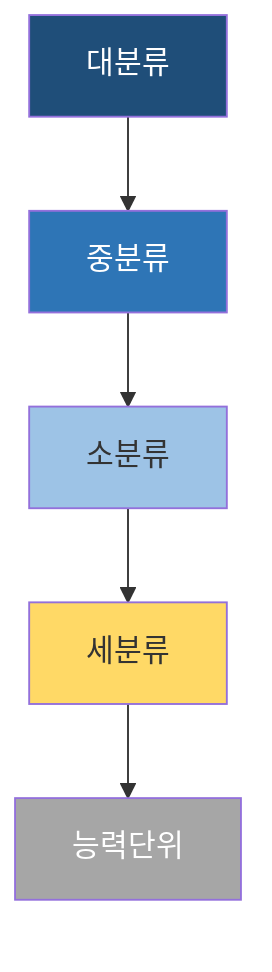

# NCS 분류체계 시각화 가이드

## 8단계 위계 (전체)

```
1. 대분류 (Major)        — 24개
2. 중분류 (Sub-major)    — 80개
3. 소분류 (Minor)        — 257개
4. 세분류 (Detail)       — 1,022개 ← 여기까지가 "직무 분류"
─────────────────────────────────
5. 능력단위              — 직무별 다수
6. 능력단위요소          — 능력단위별 3~7개 일반적
7. 수행준거              — 요소별 2~5개
8. 학습모듈              — 능력단위와 1:1 또는 1:n 대응
```

> 처음 4단계 = 분류체계. 5~7단계 = 능력 정의. 8단계 = 학습 매핑.

## 대분류 24개 (분류번호 LL = 대분류 코드)

| 코드 | 대분류 |
|---|---|
| 01 | 사업관리 |
| 02 | 경영·회계·사무 |
| 03 | 금융·보험 |
| 04 | 교육·자연·사회과학 |
| 05 | 법률·경찰·소방·교도·국방 |
| 06 | 보건·의료 |
| 07 | 사회복지·종교 |
| 08 | 문화·예술·디자인·방송 |
| 09 | 운전·운송 |
| 10 | 영업판매 |
| 11 | 경비·청소 |
| 12 | 이용·숙박·여행·오락·스포츠 |
| 13 | 음식서비스 |
| 14 | 건설 |
| 15 | 기계 |
| 16 | 재료 |
| 17 | 화학·바이오 |
| 18 | 섬유·의복 |
| 19 | 전기·전자 |
| 20 | 정보통신 |
| 21 | 식품가공 |
| 22 | 인쇄·목재·가구·공예 |
| 23 | 환경·에너지·안전 |
| 24 | 농림어업 |

(개정 시점에 따라 미세 변동. 답변 시 개정 연도 확인.)

## 분류번호 디코더 (8자리)

```
0 2 | 0 1 | 1 5 | 0 1
↑     ↑     ↑     ↑
대   중   소   세
경영  기획  경영  경영
회계  사무  기획  기획
사무
```

답변에 분류번호 등장 시 항상 **풀 네임 병기**:
- ❌ `02011501`
- ✅ `02011501 (경영·회계·사무 > 기획사무 > 경영기획 > 경영기획)`

## NCS 수준 체계 (1~8수준)

능력단위마다 부여되는 난이도·복잡도 등급. 단순한 "초급-고급"이 아니라 다음 4축으로 정의:

| 수준 | 정의 키워드 |
|---|---|
| 1 | 단순·반복 업무, 직접 감독, 정형화 |
| 2 | 기본적 업무, 일부 자율, 명확한 절차 |
| 3 | 다양한 직무수행, 한정된 자율 |
| 4 | 포괄적 직무수행, 상당한 자율 |
| 5 | 광범위한 직무수행, 광범한 자율, 후배 지도 |
| 6 | 비정형·복잡 직무, 부분적 책임 |
| 7 | 전문적 직무, 광범한 책임 |
| 8 | 최고도 전문성, 의사결정 책임 |

### 수준 분포 차트 패턴

```python
import numpy as np
import matplotlib.pyplot as plt

# 한글 폰트 보일러플레이트 (economics-viz와 동일)
import matplotlib.font_manager as fm
for f in ["Noto Sans CJK KR", "NanumGothic", "Malgun Gothic", "AppleGothic"]:
    if f in {p.name for p in fm.fontManager.ttflist}:
        plt.rcParams["font.family"] = f
        break
plt.rcParams["axes.unicode_minus"] = False

levels = np.arange(1, 9)
counts = np.array([12, 28, 45, 38, 21, 9, 4, 1])    # 예시

fig, ax = plt.subplots(figsize=(7, 4))
ax.bar(levels, counts, color="#4472C4", edgecolor="black")
ax.set_xticks(levels)
ax.set_xlabel("NCS 수준")
ax.set_ylabel("능력단위 수")
ax.set_title("○○ 직무 능력단위 수준 분포 (예시)")
ax.grid(True, axis="y", alpha=0.3)
plt.tight_layout()
```

## 색상 정책 (NCS 도식 일관성)

| 의미 | 색상 |
|---|---|
| 대분류 | 짙은 파랑 `#1F4E79` |
| 중분류 | 중간 파랑 `#2E75B6` |
| 소분류 | 연파랑 `#9DC3E6` |
| 세분류 (직무) | 노랑 강조 `#FFD966` |
| 능력단위 | 회색 `#A6A6A6` |
| 능력단위요소 | 옅은 초록 `#A9D18E` |
| 수행준거 | 옅은 주황 `#F4B183` |

Mermaid에서:


