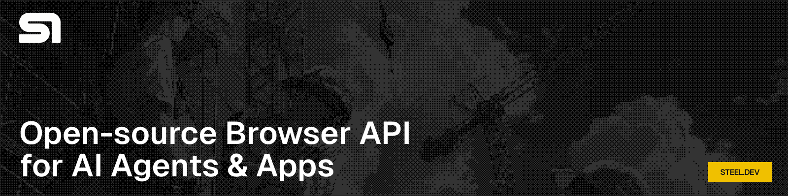

<!-- title -->

# Awesome Web Agents (AI 웹 에이전트 모음)

  
  
  

<!-- subtitle -->

AI가 웹을 탐색하고 상호작용할 수 있도록 하는 도구, 프레임워크, 리소스를 정리한 큐레이션 목록입니다.

<h2>Steel 소개</h2>
<!-- image -->

Steel은 AI 에이전트를 위해 만들어진 [오픈소스](https://github.com/steel-dev/steel-browser) 브라우저 API입니다. 웹과 효과적으로 상호작용하는 AI 애플리케이션을 쉽게 구축할 수 있습니다.

✨ [여기서](https://app.steel.dev) 무료로 시작하세요.

<h2>목차</h2>

- [Awesome Web Agents (AI 웹 에이전트 모음)](#awesome-web-agents-ai-웹-에이전트-모음)
  - [자율 웹 에이전트](#자율-웹-에이전트)
    - [AI 브라우저](#ai-브라우저)
    - [컴퓨터 사용 에이전트](#컴퓨터-사용-에이전트)
  - [모바일 에이전트](#모바일-에이전트)
    - [모바일 개발 및 테스트 도구](#모바일-개발-및-테스트-도구)
    - [모바일 MCP 서버](#모바일-mcp-서버)
    - [모바일 벤치마크](#모바일-벤치마크)
  - [AI 웹 자동화 도구](#ai-웹-자동화-도구)
    - [개발 도구](#개발-도구)
  - [AI 웹 스크레이퍼/크롤러](#ai-웹-스크레이퍼크롤러)
  - [웹 검색 및 쿼리 도구](#웹-검색-및-쿼리-도구)
  - [벤치마크 및 연구](#벤치마크-및-연구)
  - [튜토리얼 및 가이드](#튜토리얼-및-가이드)
  - [금융공기업 NCS 기출문제 모음](#금융공기업-ncs-기출문제-모음)

<!-- CONTENT -->

## 자율 웹 에이전트

사용자 친화적인 인터페이스를 통해 자율적으로 웹을 탐색하고 상호작용하는 AI 에이전트입니다. (브라우저 에이전트라고도 함)

- [Surf.new](https://surf.new) - 다양한 웹 에이전트와 대화할 수 있는 오픈소스 플레이그라운드. 
- [OpenAI Operator](https://openai.com/index/introducing-operator/) - OpenAI의 웹 브라우징 AI 에이전트. 현재 ChatGPT Pro/Plus/Team 사용자를 위한 에이전트 모드로 통합됨.
- [Browser-Use](https://www.browser-use.com) - 웹을 LLM 친화적으로 만드는 최첨단 에이전트 및 프레임워크. 
- [Skyvern-AI](https://www.skyvern.com/) - 브라우저 기반 워크플로우를 자동화하는 프레임워크. 
- [Proxy by Convergence](https://convergence.ai) - 간단한 대화를 통해 웹을 탐색하고 작업을 수행하는 AI 디지털 어시스턴트.
- [Google Project Mariner](https://deepmind.google/technologies/project-mariner/) - 브라우저에서 시작하는 인간-에이전트 상호작용의 미래를 탐구하는 연구 프로토타입.
- [Runner H](https://www.hcompany.ai/) - 복잡하고 번거로운 다단계 작업을 반복적인 수동 입력 없이 자동화하는 최첨단 AI 에이전트.
- [WebVoyager (에이전트)](https://github.com/MinorJerry/WebVoyager) - 시각 기능이 탑재된 웹 에이전트. 
- [AgentGPT](https://github.com/reworkd/AgentGPT) - 브라우저에서 자율 AI 에이전트를 배포. 
- [Agent-E](https://github.com/EmergenceAI/Agent-E) - HTML DOM 정제 기능을 갖춘 에이전트 및 프레임워크. 
- [Kura](https://www.trykura.com/) - 기업을 위한 웹 에이전트.
- [Manus](https://manus.im/) - 브라우저, 터미널, 텍스트 편집기에서 장기 실행 작업을 수행하는 범용 AI 에이전트. 2025년 12월 Meta에 인수됨.
- [doBrowser](https://www.dobrowser.io) - 자연어를 이해하고 브라우저에서 대신 작업을 수행하는 AI 크롬 확장 프로그램.
- [WebSurfer (Autogen)](https://microsoft.github.io/autogen/stable/reference/python/autogen_ext.agents.web_surfer.html#autogen_ext.agents.web_surfer.MultimodalWebSurfer) - 웹 검색 및 웹 페이지 방문이 가능한 멀티모달 에이전트. 
- [Magentic-One](https://www.microsoft.com/en-us/research/articles/magentic-one-a-generalist-multi-agent-system-for-solving-complex-tasks/) - Autogen의 MultimodalWebSurfer를 통한 웹 서핑을 포함하여 복잡한 작업을 해결하는 범용 멀티 에이전트 시스템.
- [Harpa.ai](https://harpa.ai/) - 자연어를 이해하고 대신 작업을 수행하는 AI 크롬 확장 프로그램 및 브라우저 에이전트.
- [Yutori](https://yutori.com/) - 자연어 프롬프트로 브라우저 기반 작업을 병렬로 실행하는 멀티 에이전트 시스템.
- [Automina](https://automina.app/) - 자연어 제어가 가능한 AI 브라우저 자동화 도구.
- [rtrvr.ai](https://www.rtrvr.ai/) - 프롬프트만으로 자율적으로 작업을 수행하고, 시트에 스크래핑하고, API를 호출하는 AI 웹 에이전트 크롬 확장 프로그램.
- [Nanobrowser](https://nanobrowser.ai) - 유연한 LLM 옵션과 멀티 에이전트 시스템을 갖춘 오픈소스 로컬 우선 AI 웹 에이전트 크롬 확장 프로그램. 
- [Browserable](https://browserable.ai) - AI 에이전트를 위한 오픈소스 셀프호스팅 브라우저 자동화 라이브러리. 
- [Tongyi WebAgent](https://github.com/Alibaba-NLP/WebAgent) - 알리바바 그룹 Tongyi Lab에서 만든 정보 탐색용 웹에이전트. 
- [Agent-S](https://github.com/simular-ai/Agent-S) - 사람처럼 컴퓨터를 사용하는 오픈 에이전트 프레임워크. Agent S3는 OSWorld에서 인간 수준의 성능(72.60%)을 돌파. ICLR 2025 최우수 논문상. 
- [Amazon Nova Act](https://github.com/aws/nova-act) - AWS의 브라우저 에이전트 구축용 Python SDK. ScreenSpot Web Text 벤치마크 0.939점, Playwright 통합. 
- [BrowserOS](https://github.com/browseros-ai/BrowserOS) - AI 에이전트를 네이티브로 실행하는 오픈소스 Chromium 포크. 31개 도구를 갖춘 MCP 서버. Claude, OpenAI, Gemini, Ollama 지원. 
- [AutoAgent](https://github.com/HKUDS/AutoAgent) - 연구 및 정보 검색을 위한 멀티 에이전트 시스템이 포함된 완전 자동화 제로코드 LLM 에이전트 프레임워크. 
- [Notte](https://github.com/nottelabs/notte) - 웹 에이전트를 구축하고 안정적인 브라우저 인프라에서 서버리스 웹 자동화 함수를 배포하는 프레임워크. 
- [TheAgenticBrowser](https://github.com/TheAgenticAI/TheAgenticBrowser) - PydanticAI 기반의 멀티 에이전트 아키텍처를 사용한 자연어 브라우저 자동화. 
- [Genspark](https://www.genspark.ai/) - 여러 소스를 교차 검증하고 출처가 포함된 리포트를 생성하는 최고 등급의 AI 연구 에이전트.
- [Kortix](https://www.kortix.ai/) - 자율 웹 작업을 위한 범용 AI 에이전트 플랫폼.

### AI 브라우저

AI가 기본 내장된 에이전트 기능을 갖춘 브라우저입니다.

- [ChatGPT Atlas](https://openai.com/index/introducing-operator/) - 모든 탭에서 자율 다단계 작업을 위한 에이전트 모드가 탑재된 OpenAI의 에이전트 브라우저.
- [Perplexity Comet](https://www.perplexity.ai/comet) - Perplexity AI가 내장된 Chromium 기반 브라우저. 자율 탐색, 양식 작성, 이메일/캘린더 관리 가능.
- [Opera Neon](https://www.opera.com) - 4개의 특화 에이전트를 갖춘 에이전트 브라우저: Neon Do (웹 자동화), Neon Make (코드/크리에이티브), ODRA (심층 리서치), 채팅.
- [Google Chrome Auto Browse](https://google.com) - Premium 구독자를 위한 Gemini AI 사이드 패널을 통한 자율 작업 완료. 2026년 1월 출시.
- [Fellou](https://fellou.ai/) - 로그인된 계정에서 시각적 작업 계획으로 심층 연구를 자동화하는 최초의 공간 에이전트 AI 브라우저.
- [Dia Browser](https://www.diabrowser.com/) - The Browser Company(Arc)가 만든 AI 네이티브 브라우저. 2025년 9월 Atlassian에 인수됨.

### 컴퓨터 사용 에이전트

- [Anthropic Computer Use](https://www.anthropic.com/news/3-5-models-and-computer-use) - 브라우저를 제어할 수 있는 컴퓨터 사용 에이전트.
- [Self-Operating Computer Framework](https://github.com/OthersideAI/self-operating-computer) - 멀티모달 모델이 컴퓨터를 조작할 수 있게 하는 프레임워크. 
- [Highlight](https://highlightai.com/) - AI 모델이 데스크톱 활동을 이해할 수 있게 해주는 도구. 더 빠른 작업 처리 가능.
- [OpenInterpreter](https://github.com/openinterpreter/open-interpreter) - 코드 작성 및 실행, 브라우저 제어가 가능한 오픈소스 CLI 기반 에이전트. 
- [UI-TARS](https://github.com/bytedance/UI-TARS?tab=readme-ov-file) - 인간과 같은 인지, 추론, 행동 능력으로 GUI와 원활하게 상호작용하는 GUI 에이전트 모델. 
- [OpenAI Computer-Using Agent (CUA)](https://openai.com/index/computer-using-agent/) - GPT-4o 비전과 강화학습을 결합. WebVoyager 87%, OSWorld 38.1%. 현재 ChatGPT 에이전트 모드에 통합됨.
- [Microsoft Computer Use for Copilot Studio](https://www.microsoft.com/en-us/copilot/copilot-studio) - Copilot Studio 에이전트가 Microsoft 호스팅 인프라에서 GUI를 통해 모든 애플리케이션과 상호작용할 수 있게 함.

## 모바일 에이전트

AI가 스마트폰 앱을 자율적으로 조작하고, 모바일 디바이스에서 작업을 자동화하는 에이전트 및 프레임워크입니다.

- [DroidRun](https://github.com/droidrun/droidrun) - 자연어 명령으로 Android/iOS 디바이스를 제어하는 LLM 기반 모바일 에이전트 프레임워크. AndroidWorld 벤치마크 1위. €2.1M 프리시드 투자 유치. 
- [Mobile-Use (Minitap)](https://github.com/minitap-ai/mobile-use) - 실제 Android/iOS 앱을 사람처럼 사용하는 AI 에이전트 프레임워크. AndroidWorld 벤치마크 100% 달성 최초 프레임워크. $4.1M 시드 투자 유치. 
- [MobileAgent (X-PLUG)](https://github.com/X-PLUG/MobileAgent) - 알리바바 X-PLUG의 강력한 GUI 에이전트 패밀리. 멀티 에이전트 협업으로 복잡한 다중 앱 작업 수행. GUI-Owl 1.5 모델 포함. ICLR 2024 워크숍 채택. 
- [AppAgent (Tencent)](https://github.com/TencentQQGYLab/AppAgent) - 텐센트의 스마트폰 조작용 멀티모달 LLM 에이전트. 자율 탐색 또는 사용자 시연으로 학습하여 50개 작업, 10개 앱에서 검증. 
- [AutoDroid](https://github.com/MobileLLM/AutoDroid) - LLM 상식 지식과 앱별 도메인 지식을 결합한 Android 작업 자동화 시스템. 정확도 90.9%, 성공률 71.3%. ACM MobiCom '24 논문. 
- [Agent Device (Callstack)](https://github.com/callstackincubator/agent-device) - AI 에이전트용 iOS/Android 디바이스 제어 CLI. 접근성 트리 기반 스냅샷, 스크린샷, 녹화, 리플레이 기능. MIT 라이선스. 
- [UI-TARS (ByteDance)](https://github.com/bytedance/UI-TARS) - 인간과 같은 인지, 추론, 행동 능력으로 모바일/데스크톱 GUI와 상호작용하는 바이트댄스의 에이전트 모델. 
- [Agent-S (Simular AI)](https://github.com/simular-ai/Agent-S) - 컴퓨터와 모바일 디바이스를 사람처럼 사용하는 오픈 에이전트 프레임워크. OSWorld 인간 수준 성능(72.60%) 돌파. ICLR 2025 최우수 논문상. 
- [Open-AutoGLM (Zhipu)](https://github.com/zai-org/Open-AutoGLM) - 멀티모달 AI로 스마트폰 화면을 인식하여 자연어 명령으로 폰을 자율 조작하는 오픈소스 에이전트. Android 50개+, HarmonyOS 60개+ 앱 지원. Apache-2.0. 
- [DigiRL](https://github.com/DigiRL-agent/digirl) - 자율 강화학습으로 실제 환경에서 모바일 디바이스를 제어하는 에이전트 훈련 프레임워크. Android-in-the-Wild 성공률 67.2%. 

### 모바일 개발 및 테스트 도구

- [Maestro](https://github.com/mobile-dev-inc/Maestro) - YAML 기반의 Android/iOS/웹 E2E 테스트 프레임워크. MaestroGPT AI 어시스턴트 및 MCP 통합 지원. Appium 대안. 
- [Arbigent](https://github.com/takahirom/arbigent) - 5분 만에 시작하는 Android/iOS/웹 앱 AI 테스트 에이전트. 직관적 UI와 시나리오 분해 기능으로 복잡한 작업도 확장 가능. 
- [Firebase App Testing Agent](https://firebase.google.com/docs/app-distribution/android/app-testing-agent) - 자연어로 테스트 목표를 정의하면 Gemini AI가 Android 앱을 자동 탐색하고 테스트하는 Google Firebase 기반 도구. CI/CD 통합 지원.

### 모바일 MCP 서버

- [Appium MCP (공식)](https://github.com/appium/appium-mcp) - Appium의 공식 MCP 서버. Claude 등 AI 에이전트가 자연어로 Android/iOS 디바이스를 자동화할 수 있게 연결. 
- [Claude-in-Mobile](https://github.com/AlexGladkov/claude-in-mobile) - Claude를 통해 자연어로 Android/iOS/Desktop/Aurora OS 디바이스를 제어하는 MCP 서버. 단일 2MB Rust 바이너리. 

### 모바일 벤치마크

- [AndroidWorld (Google Research)](https://github.com/google-research/android_world) - 20개 앱, 116개 작업의 동적 모바일 에이전트 벤치마크 환경. 수백만 개의 고유 작업 변형 생성 가능. ICLR 2025. 
- [MobileWorld (Tongyi-MAI)](https://github.com/Tongyi-MAI/MobileWorld) - AndroidWorld의 후속 벤치마크. 201개 작업, 62.2% 다중 앱 태스크, 에이전트-사용자 상호작용 및 MCP 도구 통합 평가. 

## AI 웹 자동화 도구

자연어 지시를 웹 상호작용으로 변환하는 도구, 프레임워크 및 라이브러리입니다.

- [Asteroid.ai](https://asteroid.ai/) - 중소기업의 복잡한 워크플로우를 자동화하는 호스팅 브라우저 에이전트. 
- [PulsarRPA](https://github.com/platonai/pulsarRPA) - AI 기반 데이터 추출 브라우저 자동화. 
- [VimGPT](https://github.com/ishan0102/vimGPT) - Vimium 확장 프로그램을 통해 GPT-4 Vision으로 웹을 탐색하는 실험 프로젝트. 
- [Cekura.io](https://www.cekura.io/) - 기업이 문서를 최신 상태로 유지하도록 도와주는 AI 브라우저 에이전트.
- [Dex by Dexterity](https://getdexterity.com/) - 브라우저에 내장되어 브라우저를 제어하는 AI 동료.
- [Autobrowser](https://autobrowser.ai/) - Claude Computer Use를 활용하여 브라우저 작업을 자동화하는 무료 실험적 크롬 확장 프로그램.
- [Bytebot](https://bytebot.ai) - 대상 사이트에 맞춰 진화하는 AI 기반 스크래핑 자동화 도구.
- [Runcopycat](https://www.runcopycat.com/) - 화면 녹화를 재사용 가능한 자동화 워크플로우로 변환하는 노코드 브라우저 자동화 플랫폼.
- [Bardeen.ai](https://bardeen.ai) - 브라우저 내에서 직접 작업과 워크플로우를 자동화할 수 있는 AI 기반 크롬 확장 프로그램.
- [Starizon.ai](https://starizon.ai/) - 웹 작업 자동화를 위한 브라우저 어시스턴트.
- [BrowserGPT](https://browsegpt.ai/) - 페이지 요약 및 Q&A를 위한 브라우저 확장 프로그램.
- [Browse.ai](https://www.browse.ai/) - AI를 활용한 구조화된 데이터 추출이 가능한 크롬 확장 프로그램 웹스크래퍼.
- [Strawberry Browser](https://www.strawberrybrowser.com/) - 브라우저에 상주하며 반복적인 웹 작업을 자동화하고 워크플로우를 학습하는 개인 어시스턴트.
- [Deta.surf](https://deta.surf/) - 브라우저, 파일 관리자, AI 어시스턴트를 브라우저 수준의 컨텍스트와 함께 결합한 통합 플랫폼.
- [Reworkd](https://reworkd.ai) - 에이전트 AI를 사용한 노코드 웹 데이터 추출 솔루션.
- [Ottogrid](https://ottogrid.ai/) - 수동 리서치를 자동화하는 스프레드시트 기반 웹 에이전트.

### 개발 도구

- [Steel.dev](https://steel.dev) - AI 에이전트 및 앱을 위해 특별히 제작된 오픈소스 헤드리스 브라우저 API. 
- [Omniparser](https://microsoft.github.io/OmniParser/) - 비전 기반 에이전트를 위한 GUI 파싱 도구. 
- [LaVague](https://www.lavague.ai/) - 자연어 웹 자동화 프레임워크. 
- [Langchain Playwright toolkit](https://python.langchain.com/docs/integrations/tools/playwright/#use-within-an-agent) - AI 에이전트와의 툴킷 통합.
- [Browserbase](https://browserbase.com) - AI 에이전트를 위한 서버리스 브라우저 인프라. 시리즈 B 4천만 달러 (2025년 6월), 5천만+ 세션, 1000+ 고객.
- [Stagehand](https://www.stagehand.dev/) - AI 웹 브라우징 프레임워크. v3에서 Playwright 의존성 제거, 네이티브 CDP 추가, 44% 빨라짐. 다중 언어 SDK (Python, Go, Kotlin, C#, Ruby). 
- [Tarsier](https://github.com/reworkd/tarsier) - 웹 상호작용 에이전트를 위한 비전 유틸리티 라이브러리. 
- [AutoGPT](https://github.com/Significant-Gravitas/AutoGPT) - 작업 완료 및 웹 브라우징을 위한 실험적 에이전트. 
- [Bytebot](https://github.com/bytebot-ai/bytebot) - 가상 데스크톱 환경이 포함된 컨테이너화된 컴퓨터 사용 에이전트 프레임워크. 
- [Playwright MCP Server](https://github.com/microsoft/playwright-mcp) - Playwright를 통한 브라우저 자동화를 위한 Microsoft의 MCP 서버. 접근성 스냅샷 사용. GitHub Copilot Coding Agent에 내장. 
- [Vercel Agent Browser](https://github.com/vercel-labs/agent-browser) - Vercel Labs의 AI 에이전트 전용 헤드리스 브라우저 자동화 CLI. 
- [Browser-Use Web UI](https://github.com/browser-use/web-ui) - DeepSeek-r1의 심층 사고 지원으로 브라우저에서 AI 에이전트 실행. 

## AI 웹 스크레이퍼/크롤러

AI를 활용하여 웹사이트를 탐색하고 콘텐츠를 추출하는 웹 크롤러 및 스크레이퍼입니다.

- [FireCrawl](https://www.firecrawl.dev/) - 웹사이트를 LLM 친화적인 마크다운으로 변환하는 API. 
- [Crawl4AI](https://crawl4ai.com) - 오픈소스 LLM 친화적 웹 크롤러 및 스크레이퍼. 
- [ScrapeGraphAI](https://scrapegraphai.com/) - AI 기반 Python 스크레이퍼. 
- [WebAgent (OpenAgents)](https://github.com/xlang-ai/OpenAgents) - OpenAgents 플랫폼(홍콩대)의 웹 브라우징 에이전트 모듈. 대규모 멀티모달 에이전트 프레임워크의 일부로 자연어를 통한 자율 웹사이트 탐색 지원. 
- [Expand.ai](https://www.expand.ai/) - 모든 웹사이트를 신뢰할 수 있는 타입 안전 API로 변환.
- [LLM Scraper](https://github.com/mishushakov/llm-scraper) - LLM을 활용한 지능형 스크래핑 및 콘텐츠 이해 도구. 
- [SpiderCreator](https://github.com/carlosplanchon/spidercreator) - 자연어 프롬프트로 복잡한 Playwright 스파이더 생성. 
- [Scrapling](https://github.com/D4Vinci/Scrapling) - 인터랙티브 셸이 포함된 적응형 웹 스크래핑 프레임워크. 92% 테스트 커버리지, BeautifulSoup과 유사한 API. 
- [Crawl4AI MCP Server](https://github.com/sadiuysal/crawl4ai-mcp-server) - Crawl4AI를 AI 에이전트용 도구로 노출하는 MCP 서버. 셀프호스팅 Firecrawl 대안. OpenAI Agents SDK, Cursor, Claude Code와 호환. 

## 웹 검색 및 쿼리 도구

에이전트가 자연어로 웹을 검색하거나 웹 데이터를 쿼리하는 데 도움이 되는 유틸리티입니다.

- [AgentQL](https://www.agentql.com/) - 웹을 AI 친화적으로 만드는 쿼리 언어 및 툴킷. 
- [SerpAPI](https://serpapi.com/) - 에이전트에 구글 검색 결과를 제공하는 검색 API.
- [Serper.dev](https://serper.dev/) - 에이전트에 구글 검색 결과를 제공하는 고성능 저비용 검색 API.
- [Jina.ai](https://jina.ai/) - 웹 데이터를 위한 뉴럴 검색 플랫폼.
- [Exa.ai](https://exa.ai) - AI를 위한 시맨틱 검색 엔진.

## 벤치마크 및 연구

웹 기능을 갖춘 AI 에이전트를 평가하고 발전시키기 위한 데이터셋, 벤치마크, 주요 연구입니다.

- [Web Agent Leaderboard](https://leaderboard.steel.dev) - 널리 사용되는 WebVoyager 벤치마크에서 다양한 AI 에이전트 제품의 성능을 비교하는 웹 에이전트 리더보드. 
- [Web Games by Convergence](https://webgames.convergence.ai/) - 범용 웹 브라우징 AI 에이전트를 테스트하기 위해 설계된 챌린지 모음. 
- [Bananalyzer](https://github.com/reworkd/bananalyzer) - 웹 기반 AI 에이전트를 위한 오픈소스 평가 프레임워크. 
- [Mind2Web](https://osu-nlp-group.github.io/Mind2Web) - 범용 웹 에이전트를 위한 대규모 데이터셋. 
- [World of Bits](https://proceedings.mlr.press/v70/shi17a/shi17a.pdf) - OpenAI의 연구 논문. 에이전트가 키보드와 마우스 조작으로 인터넷에서 작업을 완료하는 플랫폼 소개.
- [MiniWoB++](https://miniwob.farama.org) - 합성 환경에서 104개의 미니 웹 브라우저 작업을 포함하는 고전적인 테스트 스위트. OpenAI MiniWoB 벤치마크의 확장판. 
- [WebArena](https://webarena.dev) - 자율 에이전트를 위한 현실적이고 셀프호스팅 가능한 웹 환경. 에이전트 성능을 추적하는 공식 리더보드 포함. 
- [WebCanvas](https://github.com/iMeanAI/WebCanvas) - 동적 웹 환경을 위한 온라인 평가 프레임워크. 실제 웹사이트에서 에이전트를 테스트. 
- [WebGPT](https://openai.com/research/webgpt) - OpenAI의 브라우저 보조 질문 응답 연구 프로젝트.
- [WebShop](https://webshop-pnlp.github.io) - 118만 개의 실제 Amazon 제품이 포함된 시뮬레이션 전자상거래 쇼핑 환경. 
- [WebVoyager (벤치마크)](https://github.com/MinorJerry/WebVoyager) - 실제 웹사이트 상호작용을 위해 GPT-4V를 사용하는 비전 지원 웹 에이전트. 
- [WorkArena](https://github.com/ServiceNow/WorkArena) - 기업 "지식 근로자" 시나리오를 위한 33개의 브라우저 기반 작업 스위트. 
- [BrowserGym by ServiceNow](https://github.com/ServiceNow/BrowserGym) - 웹 작업 자동화를 위한 Gym 환경. 
- [WebArena Verified](https://openreview.net/forum?id=CSIo4D7xBG) - 강화된 측정을 통한 WebArena의 재현 가능한 재평가. 위음성률 11.3% 감소. ICLR 2026.
- [MM-BrowseComp](https://openreview.net/forum?id=zIT4MLbjlO) - 웹페이지의 이미지/동영상을 활용한 멀티모달 검색 및 추론을 테스트하는 224개 수작업 질문. ICLR 2026.
- [WebChoreArena](https://openreview.net/forum?id=d0xqdsR41U) - 대규모 메모리, 계산, 장기 기억 챌린지에 걸친 노동 집약적 웹 작업을 테스트하는 532개 큐레이션된 과제. ICLR 2026.
- [ST-WebAgentBench](https://openreview.net/forum?id=IIzehISTBe) - 6개 차원에 걸친 웹 에이전트의 안전성과 신뢰성을 위한 벤치마크. ICLR 2025.
- [Deep Research Bench](https://futuresearch.ai/deep-research-bench/) - 레트로 및 라이브 평가를 통해 LLM 에이전트의 웹 리서치 수행 능력을 벤치마킹.

## 튜토리얼 및 가이드

AI 웹 에이전트를 구축, 배포 또는 활용하는 방법을 배우기 위한 리소스입니다.

- [LangGraph WebVoyager 튜토리얼](https://langchain-ai.github.io/langgraph/tutorials/web-navigation/web_voyager/) - LangGraph Agents, Vision Models, Web Voyager를 사용하여 웹 탐색 에이전트를 구축하는 방법을 보여주는 튜토리얼.
- [AI 브라우저 에이전트 만들기](https://dzone.com/articles/build-ai-browser-agent-llms-playwright-browser-use) - Playwright와 Browser-Use 라이브러리를 사용하여 웹을 탐색하는 AI를 만드는 단계별 가이드.
- [Browser-Use 로컬 설치 및 실행](https://aleksandarhaber.com/install-and-run-browser-use-ai-agents-locally-using-ollama/) - 로컬 LLM으로 오픈소스 Browser-Use 에이전트를 설치하는 방법.
- [DeepSeek으로 브라우저 에이전트 만들기](https://nodeshift.com/blog/build-a-browser-use-agent-with-deepseek-a-step-by-step-guide) - 클라우드 VM에서 DeepSeek 모델로 구동되는 Browser-Use 웹 UI 에이전트 배포 과정 안내.
- [DeepLearning.AI - AI 브라우저 에이전트 만들기](https://www.deeplearning.ai/short-courses/building-ai-browser-agents/) - 웹사이트를 안정적으로 탐색하고 상호작용하는 에이전트 구축에 대한 단기 강좌.
- [Playwright MCP 종합 가이드](https://medium.com/@bluudit/playwright-mcp-comprehensive-guide-to-ai-powered-browser-automation-in-2025-712c9fd6cffa) - Playwright MCP를 활용한 AI 기반 브라우저 자동화 가이드.
- [AI 웹 에이전트 완벽 가이드 (Skyvern)](https://www.skyvern.com/blog/ai-web-agents-complete-guide-to-intelligent-browser-automation-november-2025/) - 지능형 브라우저 자동화에 대한 종합 가이드.
- [2026년 에이전트 브라우저 현황](https://www.nohackspod.com/blog/agentic-browser-landscape-2026) - 주요 플레이어, 아키텍처, 트렌드를 다루는 완벽한 현황 가이드.

## 금융공기업 NCS 기출문제 모음

금융공기업 NCS 기출문제 및 학습 자료를 과목별, 기관별, 년도별로 분류한 큐레이션 목록입니다.

**[금융공기업 NCS 기출문제 모음 바로가기 →](../ncs/financial-exams.md)**

<!-- END CONTENT -->

## Steel 도입에 관심이 있으신가요?
[team@steel.dev](mailto:team@steel.dev?subject=Hello%20from%20github!)로 연락하시거나 [Discord](https://discord.gg/steel-dev)에서 문의하세요.

Steel은 AI 에이전트를 위해 특별히 제작된 [오픈소스](https://github.com/steel-dev/steel-browser) 브라우저 API입니다. [여기서](https://app.steel.dev) 무료로 시작하세요.

## 커뮤니티 참여

- X에서 [@steeldotdev](https://x.com/steeldotdev) 팔로우하기
- [Discord 커뮤니티](https://discord.gg/steel-dev) 참여하기
- [team@steel.dev](mailto:team@steel.dev?subject=Hello%20from%20github!)로 연락하기

## 기여하기

[어떤 형태의 기여든 환영합니다. 가이드라인을 따라주세요](contributing.md)!

### 기여자

[이 기여자들에게 감사드립니다](https://github.com/steel-dev/awesome-web-agents/graphs/contributors)!
